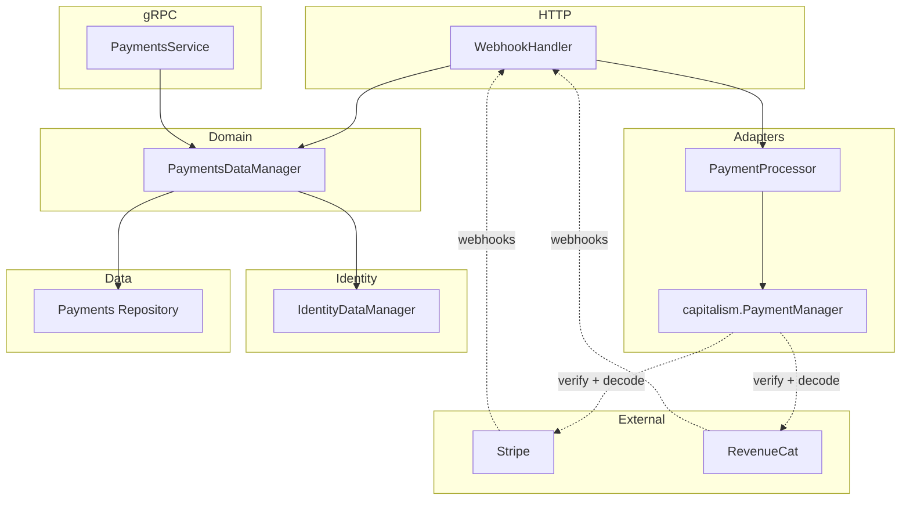

# Payments Domain

This document describes how the payments domain works, its architecture, and how to wire everything up for local development and production.

## Overview

The payments domain handles:

- **Products** — Sellable items (one-time or recurring)
- **Subscriptions** — Account subscriptions linked to products and external providers (Stripe for web, RevenueCat for mobile)
- **Purchases** — One-time purchases
- **Payment transactions** — Records of payments for auditing and reporting

It integrates with the **identity** domain: accounts store `billing_status`, `payment_processor_customer_id`, and `subscription_plan_id`, which are updated when webhooks arrive from payment providers.

---

## Architecture



### Components

| Component               | Location                                   | Role                                                                  |
|-------------------------|--------------------------------------------|-----------------------------------------------------------------------|
| **PaymentsDataManager** | `internal/domain/payments/manager/`        | Business logic: products, subscriptions, checkout, webhook processing |
| **PaymentProcessor**    | `internal/domain/payments/processor.go`    | Interface for provider webhook verification and parsing               |
| **Adapters**            | `internal/services/payments/adapters/`     | Stripe and RevenueCat (both via platform-go `capitalism`), and a dev stub |
| **Repository**          | `internal/repositories/postgres/payments/` | Persistence for products, subscriptions, purchases, transactions      |
| **gRPC Service**        | `internal/services/payments/grpc/`         | API for CreateProduct, GetSubscription, etc.                          |
| **WebhookHandler**      | `internal/services/payments/http/`         | HTTP POST endpoint for provider webhooks                              |
| **IdentityDataManager** | `internal/domain/identity/manager/`        | Updates account billing fields when subscriptions change              |

---

## Data Model

### Migration: `00011_payments.sql`

- **products** — id, name, description, kind (recurring/one_time), amount_cents, currency, external_product_id
- **subscriptions** — id, belongs_to_account, product_id, external_subscription_id, status, current_period_start/end
- **purchases** — id, belongs_to_account, product_id, amount_cents, completed_at, external_transaction_id
- **payment_transactions** — id, belongs_to_account, subscription_id, purchase_id, external_transaction_id, amount_cents, status

### Identity Integration

The `accounts` table (identity domain) stores:

- `billing_status` — paid, trial, unpaid
- `payment_processor_customer_id` — external customer ID (e.g., Stripe `cus_xxx`)
- `subscription_plan_id` — product ID of the current plan
- `last_payment_provider_sync_occurred_at` — when we last synced with the provider

These are updated by `UpdateAccountBillingFields` when webhooks arrive.

---

## PaymentProcessor Interface

All provider-specific webhook logic lives behind `payments.PaymentProcessor`:

```go
type PaymentProcessor interface {
    HandleWebhook(req *http.Request) (*ParsedWebhookEvent, error)
}
```

It takes the whole request rather than a payload plus a signature because verification is the
provider's business: a provider decides which headers it signs and how much of a body it will
read, and pulling those apart at the seam would mean deciding them on its behalf. platform-go's
`capitalism.PaymentManager` draws the same line.

Verification and parsing happen at the HTTP edge, where the request still exists. What reaches
`PaymentsDataManager` is a `ParsedWebhookEvent` — domain data — so the manager knows nothing
about HTTP.

### Implementations

| Implementation                 | Location                                            | Use case                                                                              |
|--------------------------------|-----------------------------------------------------|---------------------------------------------------------------------------------------|
| **StripePaymentProcessor**     | `internal/services/payments/adapters/stripe.go`     | Production Stripe. Delegates verification and decoding to platform-go's `capitalism`. |
| **RevenueCatPaymentProcessor** | `internal/services/payments/adapters/revenuecat.go` | Mobile in-app purchases. Delegates verification and decoding to platform-go's `capitalism`. |
| **StubPaymentProcessor**       | `internal/services/payments/adapters/stub.go`       | Local dev, integration tests. No external calls, accepts all webhooks.                |

### The adapters and `capitalism`

Neither real adapter owns its provider's protocol. Each builds a `capitalism.PaymentManager` —
`platform-go/v13/capitalism/stripe` or `.../capitalism/revenuecat` — which reads the body (capped
at 64 KiB), verifies the signature, and hands back a platform-owned `capitalism.Event` carrying
the event ID, its type, the raw JSON of its payload, and, where the event reports one, a
`SubscriptionState`. Everything each adapter does after that is translation into
`ParsedWebhookEvent`.

#### The Stripe adapter

`StripePaymentProcessor` owns none of the Stripe protocol. It builds a
`capitalism.PaymentManager` from `platform-go/v13/capitalism/stripe`, which reads the body (capped
at 64 KiB), verifies the `Stripe-Signature` header, and hands back a platform-owned
`capstripe.Event` carrying the event ID, its type, and the raw JSON of its data object.

The adapter decodes that JSON into `stripe-go/v81` structs itself, in `parseStripeEvent`. That is
the point of the platform-owned event: no stripe-go type appears in `capitalism`'s API, so the SDK
version we decode with is ours to pick and ours to bump on our own schedule.

##### Two consequences worth knowing

- `capitalism` registers exactly one event handler, at construction, and one processor serves
  every request. The adapter therefore passes a per-request sink down on the request's context and
  the handler leaves the event there — see `stripeEventSink`.
- `webhook.ConstructEvent` refuses an event stamped with an API version other than the one
  stripe-go was built against (`2025-02-24.acacia` for v81). **The Stripe webhook endpoint must be
  configured at that API version**, and bumping stripe-go means bumping it in the Stripe dashboard
  too.

#### The RevenueCat adapter

`RevenueCatPaymentProcessor` is thinner still, because RevenueCat has no SDK: `capitalism`
decodes the delivery with the standard library and hands back an event whose `Subscription`
already carries the status, so `parseRevenueCatEvent` copies three fields and maps one
vocabulary onto another.

Three things `capitalism` decides that the hand-rolled adapter it replaced did not:

- **The subscription's identity is `original_transaction_id`, not `transaction_id`.** RevenueCat
  mints a fresh transaction on every renewal and holds the original fixed, so the original is the
  handle a subscription still answers to a year later. The current transaction is the fallback for
  purchases that have no original.
- **The status comes from a table keyed on the event type**, because RevenueCat has no status
  field, with two folds applied on top: a purchase inside a free trial is *trialing* rather than
  *active*, and a `CANCELLATION` is still *active* — auto-renew was switched off and the subscriber
  keeps the period they paid for — unless its `cancel_reason` is one that ends access now.
- **An event type nobody has seen maps to no status at all** rather than onto a neighboring
  value, so a status RevenueCat adds next year cannot lock an account out on its own.

`ProcessWebhookEvent` still switches on RevenueCat's own event-type strings, which is why
`ParsedWebhookEvent.EventType` carries the provider's word for what happened rather than a mapped
one.

---

## Webhook Flow

1. **Endpoint**: `POST /api/payments/webhooks/{provider}`
   - `{provider}` selects the processor from `PaymentProcessorRegistry`: `stripe` or `revenuecat`.
     An unregistered provider is a 400.

2. **Headers**: each adapter's `capitalism` manager reads its own. Stripe signs
   `Stripe-Signature`; RevenueCat signs `X-RevenueCat-Webhook-Signature`, in the same
   `t=…,v1=` scheme Stripe published. RevenueCat's dashboard also offers an `Authorization`
   header beside the signing secret; it proves only that the sender knew a secret and says
   nothing about the body that arrived with it, so `capitalism` implements the signed mode
   alone and a delivery carrying only the header is rejected.

3. **Processing**:
   - `WebhookHandler.Handle` resolves the processor and hands it the whole request — it does not
     read the body itself.
   - `processor.HandleWebhook(r)` verifies and returns a `ParsedWebhookEvent`.
   - Calls `PaymentsDataManager.ProcessWebhookEvent(ctx, provider, event, accountID)`, where
     `accountID` comes from the `account_id` query parameter and falls back to the event's own
     (e.g. RevenueCat's `app_user_id`).
   - Manager handles `subscription.updated`, `subscription.created`, `subscription.deleted`, the
     RevenueCat event types, etc.
   - Updates subscription status in DB and account billing fields via `IdentityDataManager.UpdateAccountBillingFields`.

4. **Event types supported**:
   - `subscription.updated`, `subscription.created`, `customer.subscription.updated` → sync status, update account billing.
   - `subscription.deleted`, `customer.subscription.deleted` → mark cancelled, set account to unpaid.

---

## Configuration and Build

### Configuration

`ServicesConfig.Payments` (`internal/services/payments/config`) holds two things:

```go
type Config struct {
    Capitalism     capitalismcfg.Config `envPrefix:"CAPITALISM_" json:"capitalism,omitzero"`
    MobileProvider string               `env:"MOBILE_PROVIDER"   json:"mobileProvider,omitempty"`
}
```

`Capitalism` is platform-go's own config, and holds both providers' credentials. Its `Provider`
selects the web checkout endpoint's processor and `MobileProvider` selects the mobile store
endpoint's; there are two selectors because capitalism's config names one provider and this
service takes webhooks from two.

Both selectors follow the same rule. The provider **must** be named — `stripe` or `noop` for the
web endpoint, `revenuecat` or `noop` for the mobile one — and an unset or unrecognized value fails
at startup. That is deliberate: platform-go removed the old `Enabled` flag because a payment
manager that silently accepts every call without charging anyone looks like a working deployment
right up until someone reconciles the books. Naming `noop` is how a deployment says it has chosen
not to bill, and it is what selects `StubPaymentProcessor`.

Each endpoint takes only the provider it is named for; naming the other one is an error rather
than a swap, because the name in the registry is the name in the webhook URL.

| Environment variable                                                       | Purpose                          |
|----------------------------------------------------------------------------|----------------------------------|
| `DINNER_DONE_BETTER_SERVICE_PAYMENTS_CAPITALISM_PROVIDER`                  | `stripe` or `noop`               |
| `DINNER_DONE_BETTER_SERVICE_PAYMENTS_CAPITALISM_STRIPE_API_KEY`            | Stripe secret key                |
| `DINNER_DONE_BETTER_SERVICE_PAYMENTS_CAPITALISM_STRIPE_WEBHOOK_SECRET`     | Stripe webhook signing secret    |
| `DINNER_DONE_BETTER_SERVICE_PAYMENTS_MOBILE_PROVIDER`                      | `revenuecat` or `noop`           |
| `DINNER_DONE_BETTER_SERVICE_PAYMENTS_CAPITALISM_REVENUECAT_WEBHOOK_SECRET` | RevenueCat webhook signing secret |

All generated environment configs ship with both providers set to `noop`; change them in
`internal/config/environments/` and run `make configs`, never by editing the JSON.

The Stripe API key is optional: `capitalism` needs only the webhook secret for the inbound path,
and refuses outbound operations without a key rather than failing at construction. RevenueCat's
webhook secret is not optional — the provider is inbound-only, so a manager without one could do
nothing at all, and selecting `revenuecat` without a secret fails at startup rather than at the
first delivery.

### Dependency Injection

The container is `samber/do`. The relevant registrations:

- `paymentsrepo.RegisterPaymentsRepository`
- `paymentsmanager.RegisterPaymentsDataManager`
- `paymentsadapters.RegisterPaymentProcessorRegistry` — builds the Stripe/RevenueCat/stub map from
  config. Registered in **both** `api/grpc/build.go` and `api/http/build.go`: the combined
  HTTP+gRPC server layers `RegisterHTTPServerServices` onto the shared gRPC injector, and the
  webhook handler resolves the registry from there.
- `paymentshttp.RegisterPaymentsHTTP` — the `WebhookHandler`.

**Routes** (`internal/build/services/api/http/http_routes.go`):

- `ProvideAPIRouter` receives `*paymentswebhook.WebhookHandler`.
- Route: `router.Route("/api/payments/webhooks", ...)` with `Post("/{provider}", webhookHandler.Handle)`.

The gRPC payments service is registered in `api/grpc/extras.go`.

---

## Going Live with Stripe

### 1. Configure the provider

Set `DINNER_DONE_BETTER_SERVICE_PAYMENTS_CAPITALISM_PROVIDER=stripe` and supply the webhook
secret (and the API key, if outbound calls are wanted). The mobile endpoint is selected
separately, so this leaves `..._MOBILE_PROVIDER` alone.

### 2. Webhook URL

Configure Stripe to send webhooks to:

```text
https://<your-api-host>/api/payments/webhooks/stripe
```

Use the same signing secret in the Stripe dashboard and in
`..._CAPITALISM_STRIPE_WEBHOOK_SECRET`, and set the endpoint's **API version** to the one
stripe-go expects (see above) — a mismatch fails verification.

### 3. Products in Stripe

- Create products/prices in Stripe.
- Store `external_product_id` when creating products in our system (admin CRUD or bootstrap).
  Subscription events report the price ID, which is what `external_product_id` is matched against.

### 4. New event types

`parseStripeEvent` in `adapters/stripe.go` currently decodes only the
`customer.subscription.*` events. Adding another means adding a case there and a matching case in
`PaymentsDataManager.ProcessWebhookEvent`.

---

## Admin CRUD

**Routes** (`cmd/services/admin/routes.go`):

- Products: `/products`, `/products/new`, `/products/{id}`, `/api/products`, `/api/products/search`
- Subscriptions: `/subscriptions`, `/subscriptions/new`, `/subscriptions/{id}`, `/api/subscriptions`, `/api/subscriptions/search`

**Handlers**: `payments_products_handlers.go`, `payments_subscriptions_handlers.go`

Admin uses gRPC or repository directly to list/create/edit products and subscriptions.

---

## Permissions

**`internal/authorization/payments_permissions.go`**:

- Products: `create.products`, `read.products`, `update.products`, `archive.products`
- Checkout: `create.checkout_sessions`
- Subscriptions: `create.subscriptions`, `read.subscriptions`, `update.subscriptions`, `archive.subscriptions`, `cancel.subscriptions`
- Purchases / history: `read.purchases`, `read.payment_history`

**`internal/services/payments/grpc/permissions.go`** maps gRPC methods to these permissions. The auth interceptor enforces them.

---

## Integration Tests

**`testing/integration/apiserver/payments_test.go`**:

- `createProductForTest`, `createSubscriptionForTest` helpers
- Tests for CreateProduct, GetProduct, CreateSubscription, GetSubscription, etc.
- Uses `StubPaymentProcessor` (no external calls)

---

## Quick Reference: File Locations

| Purpose             | Path                                                    |
|---------------------|---------------------------------------------------------|
| Processor interface | `internal/domain/payments/processor.go`                 |
| Manager             | `internal/domain/payments/manager/`                     |
| Repository          | `internal/repositories/postgres/payments/`              |
| Stripe adapter      | `internal/services/payments/adapters/stripe.go`         |
| RevenueCat adapter  | `internal/services/payments/adapters/revenuecat.go`     |
| Stub adapter        | `internal/services/payments/adapters/stub.go`           |
| Adapter DI          | `internal/services/payments/adapters/do.go`             |
| Payments config     | `internal/services/payments/config/config.go`           |
| Webhook HTTP        | `internal/services/payments/http/`                      |
| gRPC service        | `internal/services/payments/grpc/`                      |
| Migration           | `migrations/migration_files/00011_payments.sql`         |
| Admin products      | `cmd/services/admin/payments_products_handlers.go`      |
| Admin subscriptions | `cmd/services/admin/payments_subscriptions_handlers.go` |
| Integration tests   | `testing/integration/apiserver/payments_test.go`        |

---

## Related Documents

- [Adding a New Domain](adding_a_new_domain.md) — General checklist for new domains
- [Migrations](migrations.md) — Migration workflow
