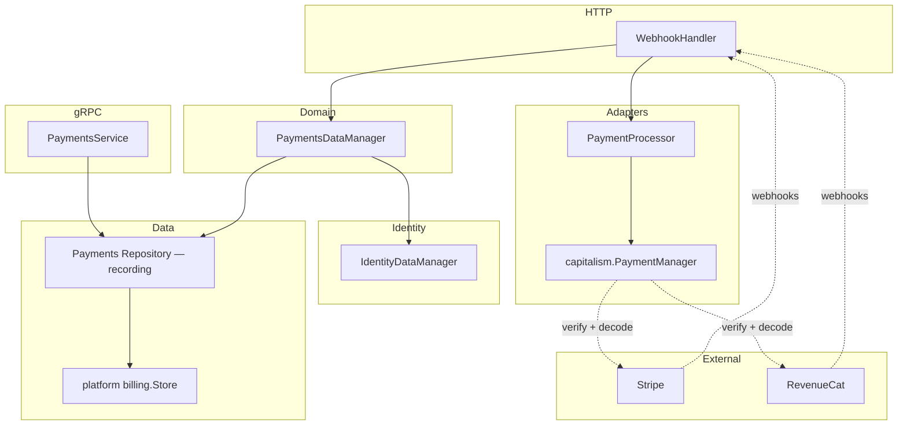

# Payments Domain

This document describes how the payments domain works, its architecture, and how to wire everything up for local development and production.

## Overview

The payments domain handles:

- **Products** — Sellable items (one-time or recurring)
- **Subscriptions** — Account subscriptions linked to products and external providers (Stripe for web, RevenueCat for mobile)
- **Purchases** — One-time purchases
- **Payment transactions** — Records of payments for auditing and reporting

Both halves of it are platform-go's, and the line between them is the one platform draws:
**`capitalism` is the wire and `billing` is the record.** `capitalism` verifies and decodes what
Stripe and RevenueCat send; `billing` owns the four tables the result lands in — the schema, the
paging, the tenancy column, the uniqueness that makes a redelivered webhook collide instead of
recording twice, and the guarded status writes. What this repository writes is what neither can
know: which provider event changes what about a subscription, what that does to the account's
standing, and the audit entry and data change event every write owes.

It integrates with the **identity** domain: accounts store `billing_status`, `payment_processor_customer_id`, and `subscription_plan_id`, which are updated when webhooks arrive from payment providers.

---

## Architecture



### Components

| Component               | Location                                   | Role                                                                                                                   |
|-------------------------|--------------------------------------------|------------------------------------------------------------------------------------------------------------------------|
| **PaymentsDataManager** | `internal/domain/payments/manager/`        | Webhook processing: which provider event changes what, and the account's standing                                      |
| **PaymentProcessor**    | `internal/domain/payments/processor.go`    | Interface for provider webhook verification and parsing                                                                |
| **Adapters**            | `internal/services/payments/adapters/`     | Stripe and RevenueCat (both via platform-go `capitalism`), and a dev stub                                              |
| **Repository**          | `internal/repositories/postgres/payments/` | platform-go's `billing.Store`, with this application's audit entries and data change events recorded around its writes |
| **gRPC Service**        | `internal/services/payments/grpc/`         | API for CreateProduct, GetSubscription, etc., served straight off the store                                            |
| **WebhookHandler**      | `internal/services/payments/http/`         | HTTP POST endpoint for provider webhooks                                                                               |
| **IdentityDataManager** | `internal/domain/identity/manager/`        | Updates account billing fields when subscriptions change                                                               |

---

## Data Model

### The four billing tables

The schema is platform-go's, rendered by `renderBillingDDL` in
`internal/repositories/postgres/migrations` as migration 43 with the `ddb` prefix (see
`payments.TablePrefix`), which drops the four tables `00011_payments.sql` created and the three
enums they used. Every table carries a tenancy `scope`, and this application keeps all four in the
global one — see `payments.Scope`.

- **ddb_billing_products** — the catalog: `kind` (`recurring`/`one_time`), `amount_cents` (BIGINT), `currency`, `billing_interval_months` (NULL for one-time), `external_product_id`
- **ddb_billing_subscriptions** — `belongs_to_account`, `product_id`, `external_subscription_id`, `status` (capitalism's vocabulary), `current_period_start`/`end`
- **ddb_billing_purchases** — `belongs_to_account`, `product_id`, `amount_cents`, `currency`, `completed_at`, `external_transaction_id`
- **ddb_billing_transactions** — the ledger: `belongs_to_account`, `subscription_id`, `purchase_id`, `external_transaction_id`, `amount_cents`, `currency`, `status`

Three things about it are worth knowing that the old schema did not have:

- **The three provider-side ids are nullable and unique within the scope.** A redelivered
  webhook collides on the index instead of recording a second row, and the store reports it as
  `ErrSubscriptionExists` / `ErrTransactionExists` so a handler acknowledges the delivery rather
  than retrying it. NULL repeats freely, so a comped plan with no provider behind it does not
  collide with the next one.
- **The status writes are guarded.** `SetSubscriptionStatus` is `SET status = X WHERE status <> X`,
  so a replayed status event touches nothing and is told `ErrStatusUnchanged`; the manager reads
  that as an acknowledgement. `CompletePurchase` is guarded on `completed_at IS NULL` the same way.
- **The subscription status is `capitalism.SubscriptionStatus`.** The five-value enum this
  repository used to define is gone; the store writes capitalism's eight, and one word differs —
  it is `canceled`, not `cancelled`.

`belongs_to_account` on the three account-owned tables carries a foreign key to `accounts` with
`ON DELETE CASCADE`, re-created by the migration because platform cannot know where a consumer's
accounts live. That preserves what the old tables did; whether billing rows should instead be
retained and anonymized is a policy question `docs/data-privacy.md` records as open.

The store owns its transactions and does not lend them out, so the audit entry and the data change
event the repository records land in a second transaction after the row's. That is the same gap
`comments`, `issuereports`, `settings` and `waitlists` carry, filed for billing as
platform-go #466 and tracked on #1419 — see `docs/audit.md`.

### Identity Integration

The `accounts` table (identity domain) stores:

- `billing_status` — paid, trial, unpaid
- `payment_processor_customer_id` — external customer ID (e.g., Stripe `cus_xxx`)
- `subscription_plan_id` — product ID of the current plan
- `last_payment_provider_sync_occurred_at` — when we last synced with the provider

These are updated by `UpdateAccountBillingFields` when webhooks arrive.

---

## PaymentProcessor Interface

All provider-specific webhook logic lives behind `payments.PaymentProcessor`:

```go
type PaymentProcessor interface {
    HandleWebhook(req *http.Request) (*ParsedWebhookEvent, error)
}
```

It takes the whole request rather than a payload plus a signature because verification is the
provider's business: a provider decides which headers it signs and how much of a body it will
read, and pulling those apart at the seam would mean deciding them on its behalf. platform-go's
`capitalism.PaymentManager` draws the same line.

Verification and parsing happen at the HTTP edge, where the request still exists. What reaches
`PaymentsDataManager` is a `ParsedWebhookEvent` — domain data — so the manager knows nothing
about HTTP.

### Implementations

| Implementation                 | Location                                            | Use case                                                                                    |
|--------------------------------|-----------------------------------------------------|---------------------------------------------------------------------------------------------|
| **StripePaymentProcessor**     | `internal/services/payments/adapters/stripe.go`     | Production Stripe. Delegates verification and decoding to platform-go's `capitalism`.       |
| **RevenueCatPaymentProcessor** | `internal/services/payments/adapters/revenuecat.go` | Mobile in-app purchases. Delegates verification and decoding to platform-go's `capitalism`. |
| **StubPaymentProcessor**       | `internal/services/payments/adapters/stub.go`       | Local dev, integration tests. No external calls, accepts all webhooks.                      |

### The adapters and `capitalism`

Neither real adapter owns its provider's protocol. Each builds a `capitalism.PaymentManager` —
`platform-go/v13/capitalism/stripe` or `.../capitalism/revenuecat` — which reads the body (capped
at 64 KiB), verifies the signature, and hands back a platform-owned `capitalism.Event` carrying
the event ID, its type, the raw JSON of its payload, and, where the event reports one, a
`SubscriptionState`. Everything each adapter does after that is translation into
`ParsedWebhookEvent`.

#### The Stripe adapter

`StripePaymentProcessor` owns none of the Stripe protocol. It builds a
`capitalism.PaymentManager` from `platform-go/v13/capitalism/stripe`, which reads the body (capped
at 64 KiB), verifies the `Stripe-Signature` header, and hands back a platform-owned
`capstripe.Event` carrying the event ID, its type, and the raw JSON of its data object.

The adapter decodes that JSON into `stripe-go/v81` structs itself, in `parseStripeEvent`. That is
the point of the platform-owned event: no stripe-go type appears in `capitalism`'s API, so the SDK
version we decode with is ours to pick and ours to bump on our own schedule.

##### Two consequences worth knowing

- `capitalism` registers exactly one event handler, at construction, and one processor serves
  every request. The adapter therefore passes a per-request sink down on the request's context and
  the handler leaves the event there — see `stripeEventSink`.
- `webhook.ConstructEvent` refuses an event stamped with an API version other than the one
  stripe-go was built against (`2025-02-24.acacia` for v81). **The Stripe webhook endpoint must be
  configured at that API version**, and bumping stripe-go means bumping it in the Stripe dashboard
  too.

#### The RevenueCat adapter

`RevenueCatPaymentProcessor` is thinner still, because RevenueCat has no SDK: `capitalism`
decodes the delivery with the standard library and hands back an event whose `Subscription`
already carries the status, so `parseRevenueCatEvent` copies three fields and maps one
vocabulary onto another.

Three things `capitalism` decides that the hand-rolled adapter it replaced did not:

- **The subscription's identity is `original_transaction_id`, not `transaction_id`.** RevenueCat
  mints a fresh transaction on every renewal and holds the original fixed, so the original is the
  handle a subscription still answers to a year later. The current transaction is the fallback for
  purchases that have no original.
- **The status comes from a table keyed on the event type**, because RevenueCat has no status
  field, with two folds applied on top: a purchase inside a free trial is *trialing* rather than
  *active*, and a `CANCELLATION` is still *active* — auto-renew was switched off and the subscriber
  keeps the period they paid for — unless its `cancel_reason` is one that ends access now.
- **An event type nobody has seen maps to no status at all** rather than onto a neighboring
  value, so a status RevenueCat adds next year cannot lock an account out on its own.

`ProcessWebhookEvent` still switches on RevenueCat's own event-type strings, which is why
`ParsedWebhookEvent.EventType` carries the provider's word for what happened rather than a mapped
one.

---

## Webhook Flow

1. **Endpoint**: `POST /api/payments/webhooks/{provider}`
   - `{provider}` selects the processor from `PaymentProcessorRegistry`: `stripe` or `revenuecat`.
     An unregistered provider is a 400.

2. **Headers**: each adapter's `capitalism` manager reads its own. Stripe signs
   `Stripe-Signature`; RevenueCat signs `X-RevenueCat-Webhook-Signature`, in the same
   `t=…,v1=` scheme Stripe published. RevenueCat's dashboard also offers an `Authorization`
   header beside the signing secret; it proves only that the sender knew a secret and says
   nothing about the body that arrived with it, so `capitalism` implements the signed mode
   alone and a delivery carrying only the header is rejected.

3. **Processing**:
   - `WebhookHandler.Handle` resolves the processor and hands it the whole request — it does not
     read the body itself.
   - `processor.HandleWebhook(r)` verifies and returns a `ParsedWebhookEvent`.
   - Calls `PaymentsDataManager.ProcessWebhookEvent(ctx, provider, event, accountID)`, where
     `accountID` comes from the `account_id` query parameter and falls back to the event's own
     (e.g. RevenueCat's `app_user_id`).
   - Manager handles `subscription.updated`, `subscription.created`, `subscription.deleted`, the
     RevenueCat event types, etc.
   - Writes the status through the store's guarded `SetSubscriptionStatus` — a redelivery is
     `ErrStatusUnchanged`, which is acknowledged rather than failed — and updates the account's
     billing fields via `IdentityDataManager.UpdateAccountBillingFields`.

4. **Event types supported**:
   - `subscription.updated`, `subscription.created`, `customer.subscription.updated` → sync status, update account billing.
   - `subscription.deleted`, `customer.subscription.deleted` → mark `canceled`, set account to unpaid.

---

## Configuration and Build

### Configuration

`ServicesConfig.Payments` (`internal/services/payments/config`) holds two things:

```go
type Config struct {
    Capitalism     capitalismcfg.Config `envPrefix:"CAPITALISM_" json:"capitalism,omitzero"`
    MobileProvider string               `env:"MOBILE_PROVIDER"   json:"mobileProvider,omitempty"`
}
```

`Capitalism` is platform-go's own config, and holds both providers' credentials. Its `Provider`
selects the web checkout endpoint's processor and `MobileProvider` selects the mobile store
endpoint's; there are two selectors because capitalism's config names one provider and this
service takes webhooks from two.

Both selectors follow the same rule. The provider **must** be named — `stripe` or `noop` for the
web endpoint, `revenuecat` or `noop` for the mobile one — and an unset or unrecognized value fails
at startup. That is deliberate: platform-go removed the old `Enabled` flag because a payment
manager that silently accepts every call without charging anyone looks like a working deployment
right up until someone reconciles the books. Naming `noop` is how a deployment says it has chosen
not to bill, and it is what selects `StubPaymentProcessor`.

Each endpoint takes only the provider it is named for; naming the other one is an error rather
than a swap, because the name in the registry is the name in the webhook URL.

| Environment variable                                                       | Purpose                           |
|----------------------------------------------------------------------------|-----------------------------------|
| `DINNER_DONE_BETTER_SERVICE_PAYMENTS_CAPITALISM_PROVIDER`                  | `stripe` or `noop`                |
| `DINNER_DONE_BETTER_SERVICE_PAYMENTS_CAPITALISM_STRIPE_API_KEY`            | Stripe secret key                 |
| `DINNER_DONE_BETTER_SERVICE_PAYMENTS_CAPITALISM_STRIPE_WEBHOOK_SECRET`     | Stripe webhook signing secret     |
| `DINNER_DONE_BETTER_SERVICE_PAYMENTS_MOBILE_PROVIDER`                      | `revenuecat` or `noop`            |
| `DINNER_DONE_BETTER_SERVICE_PAYMENTS_CAPITALISM_REVENUECAT_WEBHOOK_SECRET` | RevenueCat webhook signing secret |

All generated environment configs ship with both providers set to `noop`; change them in
`internal/config/environments/` and run `make configs`, never by editing the JSON.

The Stripe API key is optional: `capitalism` needs only the webhook secret for the inbound path,
and refuses outbound operations without a key rather than failing at construction. RevenueCat's
webhook secret is not optional — the provider is inbound-only, so a manager without one could do
nothing at all, and selecting `revenuecat` without a secret fails at startup rather than at the
first delivery.

### Dependency Injection

The container is `samber/do`. The relevant registrations:

- `paymentsrepo.RegisterPaymentsRepository` — provides `billing.Store`: platform's store with the
  recording wrapper around it. The gRPC service, the manager, the entitlements plan source and the
  privacy collector all resolve this.
- `paymentsmanager.RegisterPaymentsDataManager`
- `paymentsadapters.RegisterPaymentProcessorRegistry` — builds the Stripe/RevenueCat/stub map from
  config. Registered in **both** `api/grpc/build.go` and `api/http/build.go`: the combined
  HTTP+gRPC server layers `RegisterHTTPServerServices` onto the shared gRPC injector, and the
  webhook handler resolves the registry from there.
- `paymentshttp.RegisterPaymentsHTTP` — the `WebhookHandler`.

**Routes** (`internal/build/services/api/http/http_routes.go`):

- `ProvideAPIRouter` receives `*paymentswebhook.WebhookHandler`.
- Route: `router.Route("/api/payments/webhooks", ...)` with `Post("/{provider}", webhookHandler.Handle)`.

The gRPC payments service is registered in `api/grpc/extras.go`.

---

## Going Live with Stripe

### 1. Configure the provider

Set `DINNER_DONE_BETTER_SERVICE_PAYMENTS_CAPITALISM_PROVIDER=stripe` and supply the webhook
secret (and the API key, if outbound calls are wanted). The mobile endpoint is selected
separately, so this leaves `..._MOBILE_PROVIDER` alone.

### 2. Webhook URL

Configure Stripe to send webhooks to:

```text
https://<your-api-host>/api/payments/webhooks/stripe
```

Use the same signing secret in the Stripe dashboard and in
`..._CAPITALISM_STRIPE_WEBHOOK_SECRET`, and set the endpoint's **API version** to the one
stripe-go expects (see above) — a mismatch fails verification.

### 3. Products in Stripe

- Create products/prices in Stripe.
- Store `external_product_id` when creating products in our system (admin CRUD or bootstrap).
  Subscription events report the price ID, which is what `external_product_id` is matched against.

### 4. New event types

`parseStripeEvent` in `adapters/stripe.go` currently decodes only the
`customer.subscription.*` events. Adding another means adding a case there and a matching case in
`PaymentsDataManager.ProcessWebhookEvent`.

---

## Entitlements and privacy

The entitlements plan source is platform-go's `billing/plans` over the same store, deciding with
this application's `ChoosePlan` — see `docs/entitlements.md`. The subject access collector is
platform-go's `billing/privacy` over the same store, told which accounts a subject belongs to; there
is deliberately no eraser — see `docs/data-privacy.md`.

---

## Permissions

**`internal/authorization/payments_permissions.go`**:

- Products: `create.products`, `read.products`, `update.products`, `archive.products`
- Checkout: `create.checkout_sessions`
- Subscriptions: `create.subscriptions`, `read.subscriptions`, `update.subscriptions`, `archive.subscriptions`, `cancel.subscriptions`
- Purchases / history: `read.purchases`, `read.payment_history`

**`internal/services/payments/grpc/permissions.go`** maps gRPC methods to these permissions. The auth interceptor enforces them.

The account-scoped reads — subscriptions, purchases, payment history — answer for the session's
active account and never for the `account_id` a request names. Honoring the request's would let any
member read another account's billing by asking.

---

## Integration Tests

**`testing/integration/apiserver/payments_test.go`**:

- `createProductForTest`, `createSubscriptionForTest` helpers, built from `payments/fakes`
- Tests for CreateProduct, GetProduct, CreateSubscription, GetSubscription, etc., including that
  the store's refusals arrive as the right gRPC codes (`internal/services/payments/errors`)
- Uses `StubPaymentProcessor` (no external calls)

**`internal/repositories/postgres/payments/`** pins the recording half against a real database: every
write leaves its audit entry under the right account, a refused replay leaves none, and
`TestRepository_Integration_RecordAndEmitFailureSurfaces` is the canary that fails the day
platform-go #466 lands.

---

## Quick Reference: File Locations

| Purpose               | Path                                                                         |
|-----------------------|------------------------------------------------------------------------------|
| Processor interface   | `internal/domain/payments/processor.go`                                      |
| Scope, prefix, events | `internal/domain/payments/payments.go`                                       |
| Manager               | `internal/domain/payments/manager/`                                          |
| Repository            | `internal/repositories/postgres/payments/`                                   |
| Fakes                 | `internal/domain/payments/fakes/`                                            |
| gRPC error mapping    | `internal/services/payments/errors/`                                         |
| Stripe adapter        | `internal/services/payments/adapters/stripe.go`                              |
| RevenueCat adapter    | `internal/services/payments/adapters/revenuecat.go`                          |
| Stub adapter          | `internal/services/payments/adapters/stub.go`                                |
| Adapter DI            | `internal/services/payments/adapters/do.go`                                  |
| Payments config       | `internal/services/payments/config/config.go`                                |
| Webhook HTTP          | `internal/services/payments/http/`                                           |
| gRPC service          | `internal/services/payments/grpc/`                                           |
| Migration             | `renderBillingDDL` in `internal/repositories/postgres/migrations/migrate.go` |
| Integration tests     | `testing/integration/apiserver/payments_test.go`                             |

---

## Related Documents

- [Adding a New Domain](adding_a_new_domain.md) — General checklist for new domains
- [Migrations](migrations.md) — Migration workflow
- [Entitlements](entitlements.md) — Which plan an account is on, read from the billing store
- [platform-go v13 adoption](platform-go-v13-adoption.md) — What adopting `billing` changed, and why
