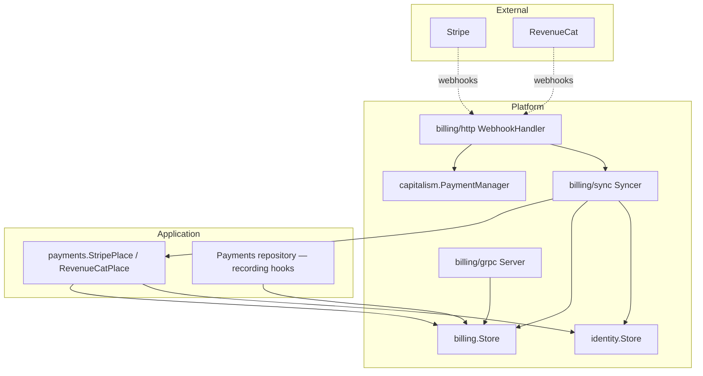

# Payments Domain

This document describes how the payments domain works, its architecture, and how to wire everything up for local development and production.

## Overview

The payments domain handles:

- **Products** — Sellable items (one-time or recurring)
- **Subscriptions** — Account subscriptions linked to products and external providers (Stripe for web, RevenueCat for mobile)
- **Purchases** — One-time purchases
- **Payment transactions** — Records of payments for auditing and reporting

Both halves of it are platform-go's, and the line between them is the one platform draws:
**`capitalism` is the wire and `billing` is the record.** `capitalism` verifies and decodes what
Stripe and RevenueCat send; `billing` owns the four tables the result lands in — the schema, the
paging, the tenancy column, the uniqueness that makes a redelivered webhook collide instead of
recording twice, and the guarded status writes. The webhook endpoint between the two is
platform's as well: `billing/http` verifies a delivery through `capitalism` and reconciles it
through `billing/sync`. What this repository writes is what none of them can know: which of its
accounts and products a provider's new subscription belongs to, which standing a reported status
means, and the audit entry and data change event every write owes.

It integrates with the **identity** domain: accounts store `billing_status`, `payment_processor_customer_id`, and `subscription_plan_id`, which are updated when webhooks arrive from payment providers.

---

## Architecture


```mermaid
flowchart TB
    subgraph External
        Stripe[Stripe]
        RC[RevenueCat]
    end

    subgraph Platform
        WH[billing/http WebhookHandler]
        CAP[capitalism.PaymentManager]
        SY[billing/sync Syncer]
        BS[billing.Store]
        ID[identity.Store]
        GS[billing/grpc Server]
    end

    subgraph Application
        PL[payments.StripePlace / RevenueCatPlace]
        PR[Payments repository — recording hooks]
    end

    Stripe -.webhooks.-> WH
    RC -.webhooks.-> WH
    WH --> CAP
    WH --> SY
    SY --> PL
    SY --> BS
    SY --> ID
    PL --> BS
    PL --> ID
    GS --> BS
    PR --> BS
```

### Components

| Component             | Location                                   | Role                                                                                                                   |
|-----------------------|--------------------------------------------|------------------------------------------------------------------------------------------------------------------------|
| **Webhook endpoints** | `internal/build/payments/webhooks.go`      | One platform `billing/http` handler per provider, each over a `billing/sync` Syncer, built from config                 |
| **Placement**         | `internal/domain/payments/placement.go`    | `StripePlace` and `RevenueCatPlace`: the account and product a subscription nobody holds yet belongs to                |
| **Repository**        | `internal/repositories/postgres/payments/` | platform-go's `billing.Store`, with this application's audit entries and data change events recorded around its writes |
| **gRPC surface**      | `internal/build/payments/grpc.go`          | platform-go's `billing/grpc` server over the same store                                                                |

---

## Data Model

### The four billing tables

The schema is platform-go's, rendered by `renderBillingDDL` in
`internal/repositories/postgres/migrations` as migration 43 with the `ddb` prefix (see
`branding.TablePrefix`), which drops the four tables `00011_payments.sql` created and the three
enums they used. Every table carries a tenancy `scope`, and this application keeps all four in the
global one — see the tenancy section of `internal/domain/payments`.

- **ddb_billing_products** — the catalog: `kind` (`recurring`/`one_time`), `amount_cents` (BIGINT), `currency`, `billing_interval_months` (NULL for one-time), `external_product_id`
- **ddb_billing_subscriptions** — `belongs_to_account`, `product_id`, `external_subscription_id`, `status` (capitalism's vocabulary), `current_period_start`/`end`
- **ddb_billing_purchases** — `belongs_to_account`, `product_id`, `amount_cents`, `currency`, `completed_at`, `external_transaction_id`
- **ddb_billing_transactions** — the ledger: `belongs_to_account`, `subscription_id`, `purchase_id`, `external_transaction_id`, `amount_cents`, `currency`, `status`

Three things about it are worth knowing that the old schema did not have:

- **The three provider-side ids are nullable and unique within the scope.** A redelivered
  webhook collides on the index instead of recording a second row, and the store reports it as
  `ErrSubscriptionExists` / `ErrTransactionExists` so a handler acknowledges the delivery rather
  than retrying it. NULL repeats freely, so a comped plan with no provider behind it does not
  collide with the next one.
- **The status writes are guarded.** `SetSubscriptionStatus` is `SET status = X WHERE status <> X`,
  so a replayed status event touches nothing and is told `ErrStatusUnchanged`; `billing/sync` reads
  that as an acknowledgement. `CompletePurchase` is guarded on `completed_at IS NULL` the same way.
- **The subscription status is `capitalism.SubscriptionStatus`.** The five-value enum this
  repository used to define is gone; the store writes capitalism's eight, and one word differs —
  it is `canceled`, not `cancelled`.

`belongs_to_account` on the three account-owned tables carries a foreign key to `accounts` with
`ON DELETE CASCADE`, re-created by the migration because platform cannot know where a consumer's
accounts live. That preserves what the old tables did; whether billing rows should instead be
retained and anonymized is a policy question `docs/data-privacy.md` records as open.

The store takes the caller's transaction, so the audit entry and the data change event the
repository records are in the same transaction as the row and share its fate. That was not true
before platform-go v14 — the store owned its transaction and committed the row before recording
was attempted, a gap `comments`, `issuereports`, `settings` and `waitlists` carried too, filed for
billing as platform-go #466. See `docs/audit.md`.

### Identity Integration

The `accounts` table (identity domain) stores:

- `billing_status` — paid, trial, unpaid
- `payment_processor_customer_id` — external customer ID (e.g., Stripe `cus_xxx`)
- `subscription_plan_id` — product ID of the current plan
- `last_payment_provider_sync_occurred_at` — when we last synced with the provider

`billing/sync` writes the first three — through `identity.BillingWriter`, on the same transaction as
the subscription row — whenever a delivery moves a subscription. A redelivery that changes nothing
writes nothing here either.

---

## Webhook Endpoints

There is no webhook code of this application's own. Each provider's endpoint is platform's
`billinghttp.NewWebhookHandler`, over a `capitalism.PaymentManager` that verifies and decodes the
delivery and a `billingsync.Syncer` that reconciles it into the store. `ProvideWebhookHandlers`
in `internal/build/payments/webhooks.go` builds one per provider and is the whole of the wiring.

The handler and the syncer each name, in their package docs, the defects of the hand-written
pipeline they replaced — this repository's, which is the copy they were written against:

- **The account is the signed payload's.** The old handler read an `account_id` query parameter
  that overrode the account in the signed payload, so anybody who could reach the URL could file
  a delivery against an account of their choosing. `billing/http`'s scope resolver is handed the
  verified event and not the request, so there is nowhere left to read one from.
- **400 only for what a redelivery cannot fix.** A failed signature or an unparseable body is
  400. Everything after verification that fails — a store or transaction error, a customer this
  service does not know yet, a product not in the catalog yet — is 500, and the provider
  redelivers. A verified delivery with nothing to reconcile is 200.
- **No invented paid period.** The old manager opened a RevenueCat subscription with
  `CurrentPeriodEnd: now.AddDate(0, 1, 0) // approximate`. `capitalism` carries the period the
  provider reported and `billing/sync` stores it; a delivery that would open an agreement with no
  bounded period is refused rather than given one.
- **No status read as active.** The old manager rewrote an empty status to `active`, which is the
  reading that keeps a lapsed account paid. A status no adapter can place is acknowledged and
  writes nothing.

### What this application decides

**Where a new subscription lands.** A delivery names the provider's customer and the provider's
product, and a subscription row needs this application's account and product. That join is a
`billingsync.Place`, consulted only when the subscription is not already stored:

| Provider   | Account                                                                                           | Product (`external_product_id`) |
|------------|---------------------------------------------------------------------------------------------------|---------------------------------|
| Stripe     | The account holding the Stripe customer, via `GetAccountByPaymentProcessorCustomerID`             | The subscription's price ID     |
| RevenueCat | The account whose ID is the `app_user_id` — the iOS app logs in to RevenueCat with its account ID | The store product ID            |

The RevenueCat account is read rather than trusted: a purchase made before the app logged in is
filed under an anonymous RevenueCat ID, and that has to be a refusal rather than a foreign key
violation. Every refusal is a 500, because a customer this service does not know yet is usually a
checkout whose own transaction has not committed, and a product nobody sells is one the operator
has not added yet.

**Which standing a reported status means** is `billing/standing.Strict`, passed to
`billingsync.WithStanding` rather than defaulted so that taking it is this deployment saying *yes,
that is our rule*: active is paid, trialing is a trial, and the other six leave the account
unpaid. No dunning window and no grace on `past_due` — a deployment that wants either writes its
own `standing.Classify`. A status `Strict` cannot place leaves the account's standing alone.

**Which tenant** a delivery is for is `billinghttp.GlobalScope`: all four billing tables live in
the global scope.

### What `capitalism` decides

- **Stripe** — `webhook.ConstructEvent` refuses an event stamped with an API version other than
  the one stripe-go was built against. **The Stripe webhook endpoint must be configured at that
  API version**, and bumping primitives-go's stripe-go means bumping it in the Stripe dashboard too.
- **RevenueCat** — the subscription's identity is `original_transaction_id`, not
  `transaction_id`; the status comes from a table keyed on the event type, with a free-trial
  purchase landing on *trialing* and a `CANCELLATION` staying *active* unless its `cancel_reason`
  ends access now; `EXPIRATION` is *canceled*, which ends the account's paid standing. An event
  type nobody has seen maps to no status at all. A lifetime purchase reports no expiry, and
  `billing/sync` refuses to open an agreement for it — a perpetual entitlement is granted through
  the store by whoever decides to grant it.

---

## Webhook Flow

1. **Endpoints**: `POST /api/payments/webhooks/stripe` and `POST /api/payments/webhooks/revenuecat`,
   one route per provider rather than a `/{provider}` pattern. Any other path under
   `/api/payments/webhooks/` is the router's 404.

2. **Headers**: each provider's `capitalism` manager reads its own. Stripe signs
   `Stripe-Signature`; RevenueCat signs `X-RevenueCat-Webhook-Signature`, in the same `t=…,v1=`
   scheme Stripe published. RevenueCat's dashboard also offers an `Authorization` header beside
   the signing secret; it proves only that the sender knew a secret and says nothing about the
   body, so `capitalism` implements the signed mode alone.

3. **Processing**, all on one transaction:
   - `capitalism` verifies the delivery and returns a `capitalism.Event`. An event that is not
     about a subscription is acknowledged.
   - `billing/sync` looks the subscription up by the provider's ID. A new one is opened through
     the `Place` above with the period the provider reported; a known one has its status and
     period moved; a redelivery is `ErrStatusUnchanged`, acknowledged as `unchanged`.
   - The account's standing is written through `identity.BillingWriter` under `standing.Strict`:
     `RecordAccountSubscription` for a live subscription, `RecordAccountSubscriptionEnded` for one
     that ended.

---

## Configuration and Build

### Configuration

`ServicesConfig.Payments` (`internal/services/payments/config`) holds two things:

```go
type Config struct {
    Capitalism     capitalismcfg.Config `envPrefix:"CAPITALISM_" json:"capitalism,omitzero"`
    MobileProvider string               `env:"MOBILE_PROVIDER"   json:"mobileProvider,omitempty"`
}
```

`Capitalism` is platform-go's own config, and holds both providers' credentials. Its `Provider`
selects the web checkout endpoint's processor and `MobileProvider` selects the mobile store
endpoint's; there are two selectors because capitalism's config names one provider and this
service takes webhooks from two.

Both selectors follow the same rule. The provider **must** be named — `stripe` or `noop` for the
web endpoint, `revenuecat` or `noop` for the mobile one — and an unset or unrecognized value fails
at startup. That is deliberate: platform-go removed the old `Enabled` flag because a payment
manager that silently accepts every call without charging anyone looks like a working deployment
right up until someone reconciles the books. Naming `noop` is how a deployment says it has chosen
not to bill, and it selects `capitalism`'s noop manager, which reports no event for any delivery —
so the endpoint answers 200 and writes nothing.

Each endpoint takes only the provider it is named for; naming the other one is an error rather
than a swap, because the name in the registry is the name in the webhook URL.

| Environment variable                                                       | Purpose                           |
|----------------------------------------------------------------------------|-----------------------------------|
| `DINNER_DONE_BETTER_SERVICE_PAYMENTS_CAPITALISM_PROVIDER`                  | `stripe` or `noop`                |
| `DINNER_DONE_BETTER_SERVICE_PAYMENTS_CAPITALISM_STRIPE_API_KEY`            | Stripe secret key                 |
| `DINNER_DONE_BETTER_SERVICE_PAYMENTS_CAPITALISM_STRIPE_WEBHOOK_SECRET`     | Stripe webhook signing secret     |
| `DINNER_DONE_BETTER_SERVICE_PAYMENTS_MOBILE_PROVIDER`                      | `revenuecat` or `noop`            |
| `DINNER_DONE_BETTER_SERVICE_PAYMENTS_CAPITALISM_REVENUECAT_WEBHOOK_SECRET` | RevenueCat webhook signing secret |

All generated environment configs ship with both providers set to `noop`; change them in
`internal/config/environments/` and run `make configs`, never by editing the JSON.

The Stripe API key is optional: `capitalism` needs only the webhook secret for the inbound path,
and refuses outbound operations without a key rather than failing at construction. RevenueCat's
webhook secret is not optional — the provider is inbound-only, so a manager without one could do
nothing at all, and selecting `revenuecat` without a secret fails at startup rather than at the
first delivery.

### Dependency Injection

The container is `samber/do`. The relevant registrations:

- `paymentsrepo.RegisterPaymentsRepository` — provides `billing.Store`: platform's store with the
  recording hooks around it. The webhook endpoints, the gRPC surface, the entitlements plan source
  and the privacy collector all resolve this.
- `paymentsbuild.RegisterWebhookHandlers` — the two endpoints, as `*paymentsbuild.WebhookHandlers`.
  Registered by `RegisterHTTPServerServices`, which layers the HTTP server's providers onto the
  gRPC API injector.
- `paymentsbuild.RegisterPaymentsService` — platform's `billing/grpc` surface.

**Routes** (`internal/build/services/api/http/http_routes.go`): `ProvideAPIRouter` receives
`*paymentsbuild.WebhookHandlers` and mounts each under `/api/payments/webhooks`.

---

## Going Live with Stripe

### 1. Configure the provider

Set `DINNER_DONE_BETTER_SERVICE_PAYMENTS_CAPITALISM_PROVIDER=stripe` and supply the webhook
secret (and the API key, if outbound calls are wanted). The mobile endpoint is selected
separately, so this leaves `..._MOBILE_PROVIDER` alone.

### 2. Webhook URL

Configure Stripe to send webhooks to:

```text
https://<your-api-host>/api/payments/webhooks/stripe
```

Use the same signing secret in the Stripe dashboard and in
`..._CAPITALISM_STRIPE_WEBHOOK_SECRET`, and set the endpoint's **API version** to the one
stripe-go expects (see above) — a mismatch fails verification.

### 3. Products in Stripe

- Create products/prices in Stripe.
- Store the Stripe **price** ID as `external_product_id` when creating products in our system
  (admin CRUD or bootstrap). `StripePlace` matches a new subscription's price against it.
- Attach the Stripe customer ID to the account (`SetAccountPaymentProcessorCustomerID`) before the
  checkout completes. `StripePlace` finds the account by it; a delivery for a customer no account
  holds is answered 500 until one does.

---

## Entitlements and privacy

The entitlements plan source is platform-go's `billing/plans` over the same store, deciding with
this application's `ChoosePlan` — see `docs/entitlements.md`. The subject access collector is
platform-go's `billing/privacy` over the same store, told which accounts a subject belongs to; there
is deliberately no eraser — see `docs/data-privacy.md`.

---

## Permissions

**`internal/authorization/payments_permissions.go`**:

- Products: `create.products`, `read.products`, `update.products`, `archive.products`
- Checkout: `create.checkout_sessions`
- Subscriptions: `create.subscriptions`, `read.subscriptions`, `update.subscriptions`, `archive.subscriptions`, `cancel.subscriptions`
- Purchases / history: `read.purchases`, `read.payment_history`

**`internal/services/payments/grpc/permissions.go`** maps gRPC methods to these permissions. The auth interceptor enforces them.

The account-scoped reads — subscriptions, purchases, payment history — answer for the session's
active account and never for the `account_id` a request names. Honoring the request's would let any
member read another account's billing by asking.

---

## Integration Tests

**`internal/build/payments/webhooks_test.go`** drives the RevenueCat endpoint exactly as production
builds it — capitalism's verifier, `billing/sync`, `billing/http`, the recording store and the
identity store — with signed deliveries against a real database (`RUN_CONTAINER_TESTS=true`). It
pins the defects listed under [Webhook Endpoints](#webhook-endpoints): the query string cannot name
the account, a delivery a redelivery could fix is answered 500 and the redelivery lands, a bad
signature is 400 and writes nothing, the stored period is the reported one, and a status nobody
can place changes nothing. `internal/domain/payments/placement_test.go` covers both `Place`s.

**`testing/integration/apiserver/payments_test.go`**:

- `createProductForTest`, `createSubscriptionForTest` helpers, built from `payments/fakes`
- `TestPayments_ArchiveSubscription`: the audit entry this application's hooks write. What the
  billing surface itself promises — reads, writes, and the gRPC codes platform's
  `billing.GRPCMapper` maps the store's refusals to — is platform's `conformance/billing` suite,
  run by `conformance_test.go`

**`internal/repositories/postgres/payments/`** pins the recording half against a real database: every
write leaves its audit entry under the right account, a refused replay leaves none, and
`TestRepository_Integration_RecordAndEmitFailureSurfaces` pins that a product whose audit entry
the database refuses rolls back with it. That test was the canary for platform-go #466; it now
asserts the behaviour #466 asked for.

---

## Quick Reference: File Locations

| Purpose                | Path                                                                         |
|------------------------|------------------------------------------------------------------------------|
| Scope and vocabulary   | `internal/domain/payments/payments.go`                                       |
| Placement              | `internal/domain/payments/placement.go`                                      |
| Webhook endpoints      | `internal/build/payments/webhooks.go`                                        |
| gRPC surface           | `internal/build/payments/grpc.go`                                            |
| Repository             | `internal/repositories/postgres/payments/`                                   |
| Fakes                  | `internal/domain/payments/fakes/`                                            |
| Payments config        | `internal/services/payments/config/config.go`                                |
| Migration              | `renderBillingDDL` in `internal/repositories/postgres/migrations/migrate.go` |
| Webhook tests          | `internal/build/payments/webhooks_test.go`                                   |
| Integration tests      | `testing/integration/apiserver/payments_test.go`                             |

---

## Related Documents

- [Adding a New Domain](adding_a_new_domain.md) — General checklist for new domains
- [Migrations](migrations.md) — Migration workflow
- [Entitlements](entitlements.md) — Which plan an account is on, read from the billing store
- [platform-go v13 adoption](platform-go-v13-adoption.md) — What adopting `billing` changed, and why
