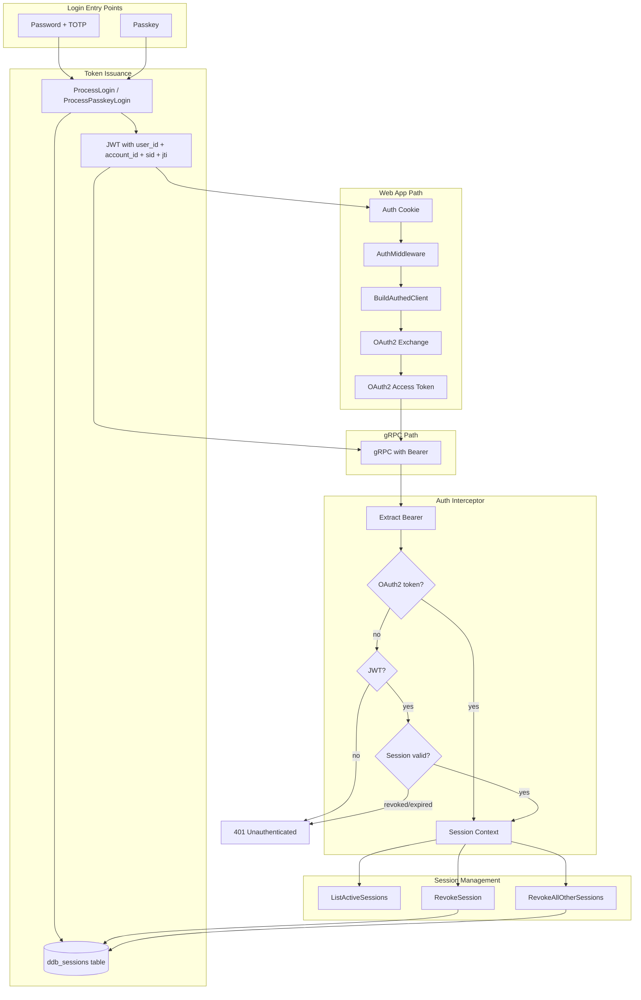

# Authentication Flow

This document describes how authentication works across the Dinner Done Better application. The system supports multiple auth methods, multiple client types, and a layered token model. For identity concepts (users, accounts, memberships), see [identity.md](identity.md).

## Overview

Authentication in this app is **convoluted by design**: there are several ways to log in, several token types, and the same token can flow through different paths depending on the client. The main sources of complexity:

1. **Multiple auth methods**: Password+TOTP and Passkey (WebAuthn)
2. **Two token systems**: JWT (from `LoginForToken`) and OAuth2 (opaque, stored as a digest, used for gRPC)
3. **Multiple client types**: Consumer web app, Admin web app, mobile apps, API clients, integration tests
4. **Different paths for different clients**: Web apps use cookies + OAuth2 exchange; some clients send JWT directly

## Token Types

### JWT (from LoginForToken / ProcessLogin / ProcessPasskeyLogin)

- **Issued by**: `internal/authentication/manager.go` via `ProcessLogin`, `ProcessPasskeyLogin`, or `ExchangeTokenForUser`
- **Format**: JWT (or PASETO, configurable) with claims: `sub` (user ID), `account_id` (optional), `sid` (session ID), `jti` (unique token ID), `exp`, `aud`, `iss`
- **Lifetime**: Configurable (e.g. 5–10 min access, 72h refresh)
- **Used for**:
  - Stored in web app auth cookie
  - Input to OAuth2 authorization flow (Bearer token proves user identity)
  - Direct Bearer token for gRPC when using `WithBearerTokenCredentials` (e.g. localdev, tests)

**Implementation**: [`internal/authentication/tokens/jwt/jwt.go`](backend/internal/authentication/tokens/jwt/jwt.go)

### OAuth2 Access Token

- **Issued by**: the OAuth 2.1 authorization server at `/authorize` + `/token`
- **Format**: opaque string; the store holds only its hex SHA-256 digest, never the token
- **Lifetime**: 15 minutes access, refresh token rotating with reuse detection
- **Used for**: gRPC `Authorization: Bearer <token>` when clients use the full OAuth2 flow

Opaque and looked up rather than signed and verified locally: that is what makes a revoked
token stop working on the next request rather than at the end of its lifetime. The cost is a
store read per request, which is the trade `oauth2server`'s package doc argues.

**Implementation**: [`internal/services/auth/handlers/authentication/oauth2.go`](backend/internal/services/auth/handlers/authentication/oauth2.go), [`oauth2_store.go`](backend/internal/services/auth/handlers/authentication/oauth2_store.go), [`oauth2_authenticator.go`](backend/internal/services/auth/handlers/authentication/oauth2_authenticator.go)

## Auth Methods

### 1. Password + TOTP (LoginForToken / AdminLoginForToken)

**Flow**:

1. Client calls gRPC `LoginForToken` (or `AdminLoginForToken` for admin-only) with username, password, and optionally TOTP.
2. `ProcessLogin` validates credentials via `Authenticator.CredentialsAreValid` (password + TOTP if 2FA verified).
3. Manager establishes a server-side session in the `ddb_sessions` table with device metadata (IP, User-Agent).
4. Manager issues JWT with `IssueToken` (user ID + account ID + session ID + JTI).
5. Client receives `TokenResponse` with `AccessToken` and `RefreshToken`.

**Entry points**:

- **Consumer web app**: `POST /login/submit` → `LoginForToken` → JWT stored in cookie
- **Admin web app**: `POST /login/submit` → `AdminLoginForToken` → JWT stored in cookie
- **gRPC clients**: Call `LoginForToken` directly, use token as Bearer or exchange for OAuth2

**Implementation**: [`internal/authentication/manager.go`](backend/internal/authentication/manager.go), [`internal/services/auth/grpc/auth.go`](backend/internal/services/auth/grpc/auth.go)

### 2. Passkey (WebAuthn)

**Flow**:

1. Client calls `BeginPasskeyAuthentication` (unauthenticated) with optional username.
2. Server returns `PublicKeyCredentialRequestOptions` and challenge; challenge stored in session.
3. User completes passkey assertion in browser.
4. Client calls `FinishPasskeyAuthentication` with assertion response and challenge.
5. WebAuthn service validates assertion, returns user ID.
6. `ProcessPasskeyLogin` creates a session record and issues JWT (same as password login).
7. Client stores JWT in cookie (web app) or uses it directly.

**Entry points**:

- **Consumer web app**: `POST /auth/passkey/authentication/options`, `POST /auth/passkey/authentication/verify`
- **Admin web app**: Same routes
- **gRPC**: `BeginPasskeyAuthentication`, `FinishPasskeyAuthentication`

**Implementation**: [`internal/authentication/webauthn/service.go`](backend/internal/authentication/webauthn/service.go), [`frontend/consumer/src/routes/auth/passkey/`](frontend/consumer/src/routes/auth/passkey/)

**Where the ceremony lives**: the ceremony itself — issuing the challenge, storing it between the
two requests, verifying the response against it — is platform's
`authentication/webauthn.RelyingParty`, configured under `auth.passkey`. What this repository owns
is the `webauthn.User` adapter, where a registered credential is stored, and the sign count written
back after a login. Two things about it are worth knowing:

- **The ceremony store is a table, in every environment.** A ceremony spans two requests and
  nothing pins them to a pod, so a per-process store fails a fraction of passkey logins on a
  multi-replica deployment in a way that reads as a browser bug. `auth.passkey.provider` defaults
  to `database`; there is no in-memory option to fall into by leaving it blank. Rows are swept
  every `auth.passkey.sweepInterval` (5 minutes by default) and the challenge is *consumed* — read
  and removed in one operation — so an assertion replayed inside its TTL finds nothing.
- **One timeout, not three.** `auth.passkey.relyingParty.ceremonyTimeout` is the timeout the
  browser is asked to honor, the deadline go-webauthn enforces when the response comes back, and
  the TTL the row is stored under. It is 2 minutes, chosen to cover a cross-device prompt (scan the
  QR code, approve on the phone) rather than only a local touch.
- **The origins come from `internal/branding`.** `RPOrigins` is
  `branding.WebAppOrigins()` in prod and `branding.LocalDevWebAppOrigins()` locally, so a
  rebrand or a moved port changes them in one place. An origin the config does not name is
  every passkey ceremony on that host failing verification.

Both ceremonies are covered end to end by `testing/integration/apiserver/auth_passkey_test.go`,
which drives a virtual ES256 authenticator (`auth_passkey_authenticator.go`) against a real
Postgres: registration, username login, usernameless login, replay of both an attestation and an
assertion, and the sign count advancing between logins.

## Password Reset

Reset tokens are platform-go's `authentication/passwordreset`, not this repo's. What that buys
is three properties a hand-written store gets wrong, and this one did:

**The token is stored as a digest, never as itself.** `ddb_password_reset_tokens.token_digest`
holds SHA-256 of the secret, hex-encoded. The secret exists exactly once, in the `Issuance` that
`Store.Issue` returns. A database copy — a backup, a read replica, a support engineer's SELECT —
is therefore not a password reset for every account with an outstanding link.

**Single use is the store's job, not the caller's.** `Store.Consume` reads the row and stamps
its redemption inside one transaction, and it is the stamp's affected-row count that decides who
owns the token. Two requests answering one link at the same instant both find the row live; one
gets the token, the other gets `ErrTokenRedeemed`. Deciding on the read, with an update
afterwards, leaves a window exactly as wide as the password write that follows.

**Expiry is refused rather than swept.** A row past its deadline is dead to `Verify` and
`Consume` whether or not anything has deleted it. The `ddb job db-cleaner` sweep reclaims the
rows; it is not what makes a link expire.

The redemption runs in the order that fails safe: vet the password, consume the token, write the
password, then `RevokeForUser` so the user's other outstanding links stop working. Consuming
after the write would leave a live reset link for an account whose password just changed.

### Where the secret travels

`CreatePasswordResetToken` issues the token and publishes a data change message; the async
handler turns that into the email. The secret rides **on the message**, under
`password_reset_token.secret`, because there is nowhere to read it back from — the row holds a
digest. The email verification token travels the same way for the same reason.

That is the one place it appears, and the email link is the one place it lands. It is never
attached to a span, a log line, or an audit entry; `RelevantID` on the audit entries below is the
row's ID, which cannot be exchanged for a token.

Issuing and redeeming are both recorded in the audit log as `password_reset_tokens`
created/updated, by a thin wrapper around the platform store — the platform has no opinion about
who wants a record of a reset, and "was a link issued for this account before the takeover, and
was it used?" is a question asked months later, after the sweeper has removed the row.

## Web App Auth Flow (Consumer / Admin)

The consumer and admin frontends use the same pattern:

1. **Login**: User submits credentials (password or passkey) → `LoginForToken` or passkey handlers → JWT returned.
2. **Cookie**: JWT is encoded and stored in a signed cookie (`AuthPayload{AccessToken}`).
3. **Per-request**: `AuthMiddleware` reads cookie, decodes JWT, calls `BuildAuthedClient(ctx, config, accessToken, developingLocally)`.
4. **Client build**:
   - **Production**: `WithOAuth2Credentials` — uses JWT as Bearer to hit `POST /authorize`, gets code, exchanges for OAuth2 token, uses OAuth2 token for gRPC.
   - **Local dev**: `BuildInsecureOAuthedGRPCClient` — same OAuth2 flow but over HTTP.
5. **gRPC calls**: Authenticated client sends OAuth2 access token (or JWT in some paths) as `Authorization: Bearer <token>`.

**Implementation**: [`internal/platform/webappauth/middleware.go`](backend/internal/platform/webappauth/middleware.go), [`internal/platform/webappauth/client_builder.go`](backend/internal/platform/webappauth/client_builder.go)

## gRPC Auth Interceptor

Every gRPC request (except unauthenticated routes) goes through `AuthInterceptor`:

1. **Extract token**: Read `Authorization: Bearer <token>` from metadata.
2. **Resolve session** (in order):
   - **OAuth2 first**: `oauth2Server.Authenticate(ctx, accessToken)` — a Store lookup by digest. If it resolves, the token's audience is checked against this server's own resource identifier (RFC 8707) and the subject's `sub` becomes the user ID. An audience naming somewhere else — the MCP server, which shares this database and therefore this store — is refused; an empty audience is accepted, because a client that sent no `resource` parameter gets one.
   - **JWT fallback**: `tokenIssuer.ParseToken(ctx, accessToken)` — if OAuth2 fails, treat as JWT.
3. **Validate session** (JWT path only): read the session the `sid` claim names, and check that the token's `jti` is the one the session was last issued with. A missing `sid`, a session that is gone or past either deadline, and a superseded token are all 401. The read is also the touch: the store refreshes the session's idle deadline, at most once per configured touch interval.
4. **Build session context**: `identityDataManager.BuildSessionContextDataForUser(ctx, userID, accountID)`. The session ID is attached to `ContextData.SessionID`.
5. **Zuck mode** (optional): If `X-Zuck-Mode-User` header present and user can impersonate, override session with that user/account.
6. **Permissions**: Check method’s required permissions against session; deny if missing.
7. **Inject context**: Store `sessions.ContextData` in request context for handlers.

**Unauthenticated routes** (skip interceptor):

- `LoginForToken`, `AdminLoginForToken`
- `BeginPasskeyAuthentication`, `FinishPasskeyAuthentication`
- `CreateUser`, `VerifyTOTPSecret`
- `RequestPasswordResetToken`, `RedeemPasswordResetToken`
- `VerifyEmailAddress`

**Implementation**: [`internal/services/auth/grpc/interceptors/authn_interceptor.go`](backend/internal/services/auth/grpc/interceptors/authn_interceptor.go)

## OAuth2 Flow (for gRPC clients)

Clients that use OAuth2 (e.g. web app via `WithOAuth2Credentials`) follow this flow:

1. Client has a JWT (from `LoginForToken` or equivalent).
2. Client calls `POST /authorize?client_id=X&state=Y&code_challenge=…&code_challenge_method=S256&…`
   with `Authorization: Bearer <JWT>`.
3. The `SubjectAuthenticator` parses the JWT, extracts `sub` (user ID), and resolves the account
   the authorization is granted against.
4. The authorization server issues an authorization code and redirects to `redirect_uri?code=Z`,
   with `state` and the RFC 9207 `iss` parameter echoed back.
5. Client (with `CheckRedirect = ErrUseLastResponse`) reads `code` from the `Location` header.
6. Client calls `POST /token` with `code`, `code_verifier`, `client_id`, `client_secret` →
   receives OAuth2 access + refresh tokens.
7. Client uses the OAuth2 access token for gRPC `Authorization: Bearer <oauth2_access_token>`.

**POST, not GET, at step 2.** A `GET /authorize` renders the login form — the answer for a
browser arriving without a session — and only a POST runs the authenticator that reads the
bearer token. Both methods carry the authorization parameters in the query string, so the
request that issues the code is validated against exactly the same bytes the GET would have been.

**Endpoints** (API server):

- `GET /.well-known/oauth-authorization-server` — RFC 8414 discovery
- `GET|POST /authorize` — authorization (GET renders the login form; POST authenticates)
- `POST /token` — token exchange (`authorization_code` and `refresh_token` only)
- `POST /revoke` — RFC 7009 token revocation

`POST /register` is **not** served. RFC 7591 dynamic registration is open by construction, and an
OAuth2 client here is an administered object created through the permission-gated gRPC surface —
an anonymous endpoint writing to the same registry would be a way around those permissions. The
discovery document therefore omits `registration_endpoint` rather than advertising a 404.

### What the API server's authorization server enforces

- **Redirect URIs matched byte for byte**, at `/authorize` and again at `/token` against the URI
  the code was issued for. Not by hostname, not ignoring ports. A client registers the exact
  string it will send.
- **PKCE mandatory, S256 only.** No `plain`, and an absent `code_challenge_method` is refused
  rather than defaulted — RFC 7636 defaults it to `plain`, so silence is a request for the
  method this server does not accept.
- **Refresh token rotation with reuse detection.** A replayed refresh token revokes the whole
  family, not just itself.
- **Every credential stored as a hex SHA-256 digest**, never as itself.
- **`authorization_code` and `refresh_token` only.** No password grant, no client credentials, no
  implicit.

### Two servers, one Store

`ddb serve` and `ddb serve mcp` are different processes running the same authorization server
package over the same four `ddb_oauth2_*` tables. That is the intended shape: `oauth2server`
ships no RFC 7662 introspection endpoint, so a resource server either shares the Store or lives
in the same process, and both of these reach the same Postgres.

It is also why the audience check in the gRPC interceptor is load-bearing rather than decorative.
A token minted by the MCP server is in the same table this server reads, so what stops it being
spent here is that its audience names somewhere else.

## The MCP server's authorization server

`ddb serve mcp` runs the same `oauth2server` package, over the same tables, at the same paths.
What differs is the two things the package deliberately leaves to the application:

|                     | API server                                     | MCP server                                          |
|---------------------|------------------------------------------------|-----------------------------------------------------|
| Who the subject is  | a session JWT, or a username + password + TOTP | a username, argon2 password, and TOTP — admins only |
| Client registration | administered, via the gRPC surface             | RFC 7591 dynamic, open, 90-day expiry               |
| `POST /register`    | not served                                     | served                                              |

Everything else — the endpoints, the tables, exact redirect URI matching, mandatory S256 PKCE,
rotation with reuse detection, opaque 15-minute access tokens — is one implementation.

The MCP side is documented in [`backend/docs/mcp-usage-guide.md`](backend/docs/mcp-usage-guide.md).

## Session Context

After auth, handlers receive `sessions.ContextData` in the request context. It contains:

- `Requester`: User ID, username, email, account status, service role
- `ActiveAccountID`: Account for this request
- `AccountPermissions`: Map of account ID → role checker
- `SessionID`: The server-side session ID (from the `sid` claim; empty for OAuth2 tokens, which name no session)

**Implementation**: [`internal/authentication/sessions/session_context.go`](backend/internal/authentication/sessions/session_context.go)

## Session Management

Users can view and manage their active login sessions. Each login (password, passkey)
establishes a session in platform-go's `sessions` store, backed by the `ddb_sessions` table,
which tracks:

- **Device metadata**: client IP, User-Agent, friendly device name (derived from the
  User-Agent), and login method — every field the client's own account of itself, rendered
  and never compared against anything
- **Activity**: `created_at`, `last_seen_at`, `expires_at`
- **Token linkage**: the JTI of the access token and of the refresh token the session was
  last issued alongside, rotated on each refresh

### Two timeouts

The store enforces both an idle timeout and an absolute one, and a session's `expires_at` is
the earlier of the two. Idle asks how long somebody may close the app and come back; absolute
asks how long a session may exist at all, which is the only bound on a stolen refresh token
— a thief is not idle. The deployed values are a week idle and thirty days absolute; see
`sessionIdleTimeout` in `internal/config/environments/utils.go`.

Reading a session refreshes its idle deadline, but no more often than the configured touch
interval — an hour, against a week. So `last_seen_at` is a session's last activity to within
an hour, and always understates it, which expires a session early rather than late.

### Revocation is a delete

Ending a session removes its row. There is no `revoked_at` column that reads have to
remember to filter on, and no second table recording which sessions are live — a session
table maintained beside the store's is a second account of the same fact, and the moment the
two disagree a revocation has not taken.

### Token Refresh and Session Continuity

When a client calls `ExchangeToken` with a refresh token, the system:

1. Extracts the `sid` and `jti` from the refresh token.
2. Reads the session — rejects if it is gone or past either deadline.
3. Rejects if this is not the refresh token the session was last issued with, which is what
   retires a refresh token that has already been spent.
4. Issues new access + refresh tokens with the same `sid` but new JTIs.
5. Writes the new pair back to the session before returning the tokens.

The session identifier is stable across refreshes, while individual tokens rotate. It is not
rotated because it is not a credential a client ever holds on its own — it rides inside a
token this server signs — so there is no identifier an attacker could have planted for a
rotation to invalidate.

### gRPC Endpoints

- **`ListActiveSessions`**: returns the live sessions the current user holds, newest first,
  each with an `is_current` flag. There is no page: a person's live sessions are the devices
  they are signed in on, which is a handful.
- **`RevokeSession`**: ends one session by ID. A session that is not the caller's is answered
  as absent rather than as forbidden, so the answer does not confirm that somebody else's
  identifier names anything.
- **`RevokeAllOtherSessions`**: ends every session but the caller's own.
- **`AdminListSessionsForUser`**, **`AdminRevokeUserSession`**,
  **`AdminRevokeAllUserSessions`**: the same three for an administrator, gated on
  `manage.user_sessions`.

### Every token names a session

A JWT this application issues always carries a `sid`, and the interceptor refuses one that
does not. A token naming no session is a token nothing can sign out.

### Sweeping

Expired rows are removed by `ddb job db-cleaner`, alongside the authorization server's and
the password reset store's — one scheduled sweep for the fleet rather than a sweeper
goroutine in every replica. The sweep is a garbage collector, not a security control: the
store refuses a session past either deadline whether or not anything has swept it.

**Implementation**: [`internal/domain/auth/user_session.go`](backend/internal/domain/auth/user_session.go), [`internal/repositories/postgres/auth/user_sessions.go`](backend/internal/repositories/postgres/auth/user_sessions.go), [`internal/services/auth/grpc/auth.go`](backend/internal/services/auth/grpc/auth.go)

## Key File Reference

| Area                                          | Path                                                                                |
|-----------------------------------------------|-------------------------------------------------------------------------------------|
| Auth manager (login, passkey, token exchange) | `internal/authentication/manager.go`                                                |
| JWT issuance/parsing                          | `internal/authentication/tokens/jwt/jwt.go`                                         |
| WebAuthn service (credentials, sign count)    | `internal/authentication/webauthn/service.go`                                       |
| WebAuthn user adapter                         | `internal/authentication/webauthn/user_adapter.go`                                  |
| Passkey ceremony config + wiring              | `internal/services/auth/grpc/do.go`                                                 |
| gRPC auth service                             | `internal/services/auth/grpc/auth.go`                                               |
| Auth interceptor                              | `internal/services/auth/grpc/interceptors/authn_interceptor.go`                     |
| OAuth2 server                                 | `internal/services/auth/handlers/authentication/oauth2.go`                          |
| OAuth2 client registry store                  | `internal/services/auth/handlers/authentication/oauth2_store.go`                    |
| OAuth2 subject authenticator                  | `internal/services/auth/handlers/authentication/oauth2_authenticator.go`            |
| Passkey HTTP endpoints (web)                  | `frontend/consumer/src/routes/auth/passkey/`                                        |
| Web app auth middleware                       | `internal/platform/webappauth/middleware.go`                                        |
| Client builder (OAuth2 + JWT)                 | `internal/platform/webappauth/client_builder.go`                                    |
| gRPC client (OAuth2, Bearer)                  | `pkg/client/client.go`                                                              |
| Password reset store (audit wrapper)          | `internal/repositories/postgres/auth/password_reset_tokens.go`                      |
| Password reset flow (issue, redeem)           | `internal/domain/auth/managers/auth_manager.go`                                     |
| Expired-row sweep (oauth2, reset, sessions)   | `internal/services/oauth/workers/db_cleaner/db_cleaner.go`                          |
| Session payload, holder, aliases              | `internal/domain/auth/user_session.go`                                              |
| Session store + audit wrapper                 | `internal/repositories/postgres/auth/user_sessions.go`                              |
| Session expiry policy config                  | `internal/authentication/config/config.go`                                          |
| Session table migration (version 35)          | `internal/repositories/postgres/migrations/migrate.go`                              |

## Flow Diagram

## Related Documentation

- [identity.md](identity.md) — Users, accounts, memberships, roles, permissions
- [email_verification.md](email_verification.md) — Email verification flow
- [backend/docs/adding_a_new_domain.md](backend/docs/adding_a_new_domain.md) — Authorization permissions for new domains
