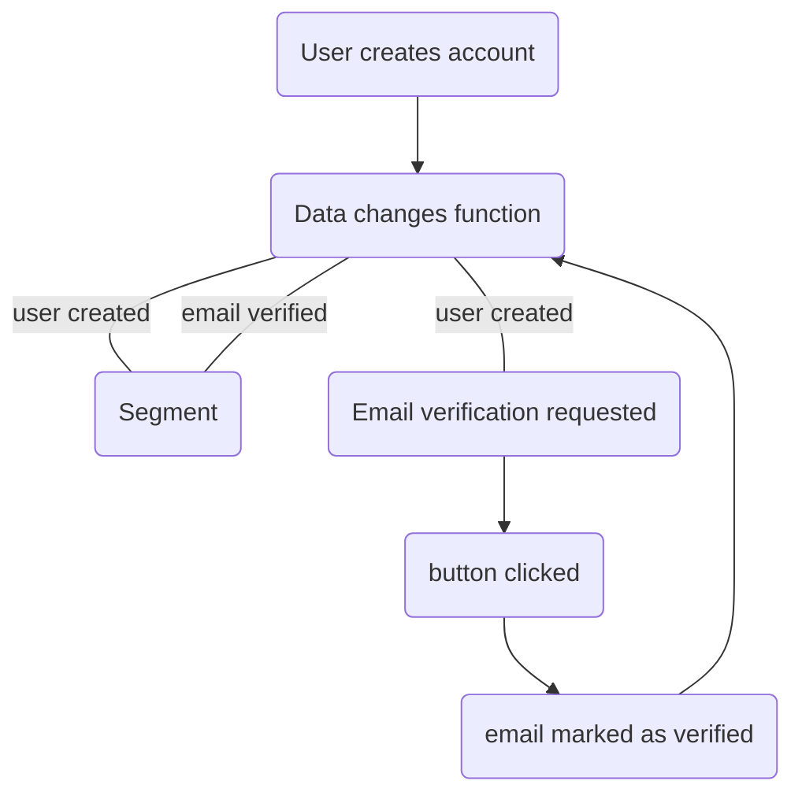

# How users email addresses get verified

## Basic process



## Where the token comes from, and where it goes

The verification token is a column on the user's own row — `users.email_address_verification_token`
([`00001_identity.sql`](../backend/internal/repositories/postgres/migrations/migration_files/00001_identity.sql))
— not a table of its own. There is one per user, written once.

**Minting.** `CreateUser` generates it inside the signup transaction: 32 random bytes,
base64url encoded, from the repository's `random.Generator`
([`postgres/identity/users.go`](../backend/internal/repositories/postgres/identity/users.go), in
the `WithTransaction` block). It is written to the column in the same `INSERT` that creates the
user, so a signup that rolls back takes its token with it.

**Delivery.** The secret rides out on the transactional outbox event under
`identitykeys.UserEmailVerificationTokenKey`, and the async handler turns that into the email:
`identity.UserSignedUpServiceEventType` and `UserEmailAddressVerificationEmailRequestedEventType`
both land in
[`datachangemessagehandler/identity_handlers.go`](../backend/internal/functions/datachangemessagehandler/identity_handlers.go)
and both call `BuildVerifyEmailAddressEmail`
([`services/identity/emails/emails.go`](../backend/internal/services/identity/emails/emails.go)),
which renders `{baseURL}/verify_email_address?t={token}`. `baseURL` is the only knob; there is no
separate verification URL setting.

The secret travels on the message here for a different reason than the password reset token does.
The reset token is a digest in its table, so the message is the only place its secret can be read
from; the verification token is stored as itself, so the message is a convenience rather than a
necessity — the resend path below reads it straight back out of the database.

**Redemption.** The email's button is a `GET` to the consumer frontend
(`frontend/consumer/src/routes/verify_email_address/`), which posts the token to the
unauthenticated gRPC `AuthService/VerifyEmailAddress`
([`services/auth/grpc/auth.go`](../backend/internal/services/auth/grpc/auth.go)) →
`AuthManager.VerifyUserEmailAddressByToken`
([`domain/auth/managers/auth_manager.go`](../backend/internal/domain/auth/managers/auth_manager.go)),
which looks the user up *by the token alone* and then calls `MarkUserEmailAddressAsVerified`. That
write stamps `email_address_verified_at`, records an audit entry, and moves the account to
`good_standing` with the explanation "verified email address", in one transaction.

**Resending.** `RequestEmailVerificationEmail` (session required) reads the stored token back with
`GetEmailAddressVerificationTokenForUser` and republishes the same event. The read filters on
`email_address_verified_at IS NULL`, so an already-verified user gets an error rather than a second
email. Resending does not rotate the token: the link in the second email is the link from the
first.

## What this token is not

The reset-token section of [auth-flow.md](auth-flow.md#password-reset) describes four properties
worth having. The verification token has none of them, and the difference is not stylistic — each
of these is checkable against the file named.

**It never expires.** There is no `expires_at` beside the column and no sweep that touches it. A
verification link mailed three years ago still works today. The only thing that ends one is the
verification it performs.

**It is not single use, and the replay reports success.** `MarkEmailAddressAsVerified` guards on
`email_address_verified_at IS NULL`, which looks like it settles the matter, but it is a `:exec`
statement whose generated Go discards the affected-row count
([`identity/generated/users.generated.sql_generated.go`](../backend/internal/repositories/postgres/identity/generated/users.generated.sql_generated.go)):

```go
func (q *Queries) MarkEmailAddressAsVerified(ctx context.Context, db DBTX, arg *MarkEmailAddressAsVerifiedParams) error {
	_, err := db.ExecContext(ctx, markEmailAddressAsVerified, arg.ID, arg.EmailAddressVerificationToken)
	return err
}
```

A second click therefore updates nothing, returns `nil`, writes a *fresh* audit entry claiming an
email address was verified, re-runs `SetUserAccountStatus`, publishes another
`UserEmailAddressVerifiedEventType`, and answers the caller `Verified: true`. Nothing in the
schema or the code distinguishes that from the first click. The token is never cleared, and
`GetUserByEmailAddressVerificationToken` does not filter on verified state, so it stays a live
lookup key for the account permanently.

**It is stored as itself.** Plaintext in the column, indexed for lookup. A database copy — a
backup, a read replica, a support engineer's `SELECT` — is a verified email address for every
account that has not clicked yet. The reset token, by contrast, is a SHA-256 digest and the secret
exists exactly once, in the `Issuance` the store returns.

**It survives an address change.** `UpdateUserEmailAddress` sets `email_address_verified_at = NULL`
but leaves the token alone, so the link mailed to the *old* address verifies the *new* one. The
token is bound to the user, never to the address it was sent to.

The one thing it does get right is the audit log. The verification entry records a change to
`email_address_verification` and does not carry the token at all, so it never reaches the trail —
and the catch-all in
[`domain/audit/redaction.go`](../backend/internal/domain/audit/redaction.go) hashes any change
field named `token` or `email_verification_token` anyway, for whatever writes one later.

## Why this is not platform's `links`

[primandproper/dinnerdonebetter#1385](https://github.com/primandproper/dinnerdonebetter/issues/1385)
decided to adopt platform-go's `links` — single-use, expiring URLs — for exactly this flow, which
would have supplied all four missing properties at once. It is blocked, and on infrastructure
rather than on work.

`links` is cache-backed. `links.NewMinter(store cache.Cache[Record], locker distributedlock.ScopedLocker, …)`
is the whole storage seam, and platform's `cache/config` offers two providers: `memory` and
`redis`. This repository provisions no Redis outside localdev — there is none in
`infra/deploy/environments/prod/`, and `internal/config/environments/prod.go` already disables the
idempotency interceptor for the same missing dependency.

The memory provider is not a smaller version of the same thing here. The link would be minted by
the async message handler, which builds the email, and redeemed by the API server, which serves the
click — two separate deployments — so a per-process cache writes every link somewhere the redeemer
cannot read. That is true at one replica each, so it is not a caveat a small deployment can accept.

Filed upstream as
[platform-go#459](https://github.com/primandproper/platform-go/issues/459): `links` is the only one
of platform's four link-and-session packages with no durable store, where `sessions` has
`sessions/database`, `webauthn` has a database provider, and `passwordreset` is SQL-only. Adoption
becomes available again when either that ticket ships a `links/database` or this deployment gains a
shared cache.

Until then the token above is what verifies an email address, and the four properties it lacks are
open work rather than accepted design.

## Loose ends worth knowing about

`AuthManager.VerifyUserEmailAddress` — the session-scoped variant taking an
`EmailAddressVerificationRequestInput` — is unreachable from the gRPC surface. The handler calls
`VerifyUserEmailAddressByToken` instead, which is the right choice for a link clicked out of an
email by someone who may not be signed in. The session-scoped method and its converter in
`services/auth/grpc/converters/converters.go` are dead in the request path.
