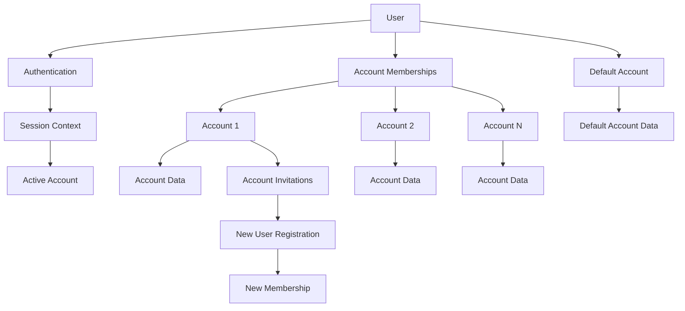
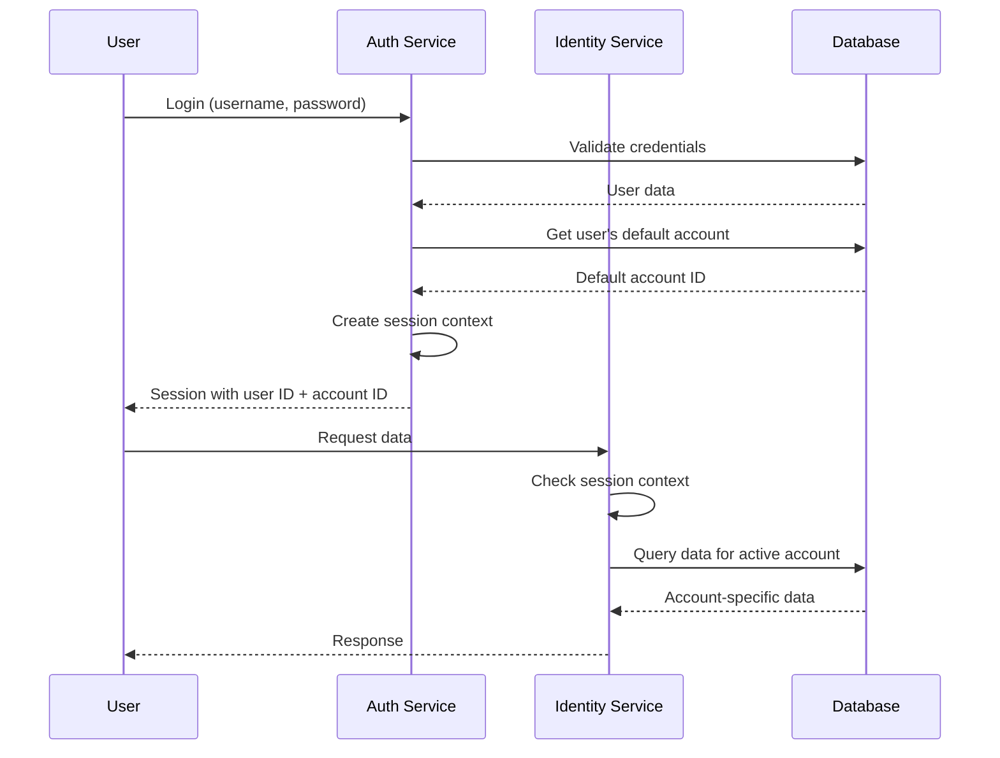

# Identity System Documentation

This document describes the identity and authentication system used in this application. The system is built around three core concepts: **Users**, **Accounts**, and **Memberships**.

Users, accounts, memberships and invitations are platform-go's, not this application's.
[`platform-go/v14/identity`](https://github.com/primandproper/platform-go/tree/main/identity) owns
the types, the store, the service and the gRPC surface; what this repository owns is the schema's
namespace, the hooks that write an audit entry and an outbox row inside the same transaction, and
the handful of rules platform leaves to a consumer. Where a name below differs from the one this
application used before the adoption, the platform's name is the one a client sees:
`CreateAccountInvitation` is `Invite`, `GetUsersForAccount` is `ListAccountMembers`, and the three
RPCs that each changed one field of a user are one `UpdateProfile`.

## Core Concepts

### Users

Users represent individual people in the system. Each user has:

- A unique identifier (`ID`)
- Authentication credentials (username, email, password)
- Personal information (first name, last name)
- A **set** of service-level roles, not one — a role is a grant and somebody may hold several
- An account status, of which only `good` admits sign-in

There is no birthday. platform's user does not carry one and this application never read it for
anything, so the field, its conversions and the tests that covered them are gone rather than
stored in a column nothing consults.

There is no avatar either, which is correct: what this application stores is a row in the uploads
registry and a reference to it, so an avatar belongs on the media surface rather than on a
directory's user. Uploading one works; see the gap noted under **Known Issues** for the read.

**Domain Definition**: platform-go's `identity.User`. This repository's
[`internal/domain/identity`](../backend/internal/domain/identity) holds what sits beside it — the
table prefix, the roster walk, the succession rule — and the fakes the tests build inputs from.

### Accounts

Accounts represent organizations or groups that users can belong to. Most data in the system is associated with accounts rather than individual users. Each account has:

- A unique identifier (`ID`)
- A name and an owner
- A billing address, which is one `BillingAddress` value rather than seven flat columns
- A billing status, and the payment processor's customer id
- A subscription plan id

An account does **not** carry its members. The roster is a separate, paged read
(`ListAccountMembers`), which is why a caller that wants every member walks the cursor to the end
— see `MembersOfAccount` in [`internal/domain/identity/roster.go`](../backend/internal/domain/identity/roster.go),
which exists so that no caller decides a meal plan's voting is complete on the strength of the
first fifty.

**Domain Definition**: platform-go's `identity.Account`.

### Memberships

Memberships define the relationship between users and accounts. Each membership has:

- A unique identifier (`ID`)
- A user ID (`BelongsToUser`)
- An account ID (`BelongsToAccount`)
- A **set** of account roles
- A flag indicating if this is the user's default account

A roster read hands back `MembershipWithUser`: the membership, and the user it names beside it
rather than nested inside it.

**Domain Definition**: platform-go's `identity.Membership`.

## Data Ownership Model

The system uses a clear data ownership model where most data is associated with accounts rather than individual users. This is indicated by the presence of `BelongsToUser` or `BelongsToAccount` fields in data structures.

**Examples**:

- User profile data: `BelongsToUser`
- Account settings: `BelongsToAccount`
- Meal plans: `BelongsToAccount`
- Webhooks: `BelongsToAccount`

## Authentication and Session Management

**For a complete description of the auth flow, including password, passkey, OAuth2, and gRPC interceptor behavior, see [auth-flow.md](auth-flow.md).**

### Token-Based Authentication

The system uses token-based authentication with JWT and PASETO support (PASETO is currently configured). Sessions are not stored server-side but are persisted through tokens.

### Authentication Flow (Summary)

1. User provides credentials (username/email + password + TOTP if 2FA is enabled), or uses passkey
2. System validates credentials and retrieves user information
3. System issues a token (JWT/PASETO) containing user ID and account information
4. Client uses this token to obtain OAuth2 credentials via the OAuth2 exchange process (web app) or sends JWT directly (some clients)
5. All subsequent gRPC requests use Bearer token (OAuth2 access token or JWT)

### OAuth2 Integration

The system runs an OAuth 2.1 authorization server for service authentication:

- **Discovery**: `GET /.well-known/oauth-authorization-server`
- **Authorization Endpoint**: `GET|POST /authorize` — a GET renders the login form, a POST
  authenticates (either a session JWT in an `Authorization` header, or posted credentials)
- **Token Endpoint**: `POST /token`
- **Revocation Endpoint**: `POST /revoke`
- Clients authenticate via `Authorization` header in gRPC requests
- HTTP endpoints only support the OAuth2 flow (legacy HTTP auth routes should be deprecated)

See [`backend/docs/auth-flow.md`](../backend/docs/auth-flow.md) for what the server enforces —
byte-exact redirect URIs, mandatory S256 PKCE, refresh rotation with reuse detection.

**OAuth2 Implementation**: [`pkg/client/client.go:WithOAuth2Credentials`](pkg/client/client.go)

### Session Context

The session context contains:

- User information (ID, username, email, account status)
- Active account ID (initially the default account)
- Account permissions map (role for each account the user belongs to)
- Service-level permissions

**Domain Definition**: [`internal/authentication/sessions/session_context.go`](internal/authentication/sessions/session_context.go)

### Two-Factor Authentication (2FA)

- All users are issued a TOTP secret during registration
- Users must verify their TOTP secret by submitting a valid TOTP code with their current password
- Once verified, TOTP is required for all login attempts
- Passwords are hashed using scrypt before storage

### Admin-Only Login

The system supports a special admin-only login mode that has stricter requirements:

1. **Service Role Restriction**: only a user whose `ServiceRoles` contain `service_admin` can use admin login
2. **2FA Requirement**: Admin login **requires** a valid TOTP token (6-digit code)
3. **Verified 2FA**: The user must have a verified 2FA secret (`two_factor_secret_verified_at IS NOT NULL`)
4. **Where the restriction lives**: in Go, not in SQL. There used to be a second query,
   `GetAdminUserByUsername`, whose extra `WHERE` clause was the whole difference; the directory
   answers one sign-in read now, and `internal/authentication/manager.go` checks the role set on
   what comes back. A filter a query forgets is a door left open, and a filter beside the decision
   it gates is one a reader can see.

**Key Differences from Regular Login**:

- Regular users can have unverified 2FA secrets and login without TOTP
- Admin login **always** requires TOTP validation
- Admin login only works for users holding the service admin role

**Implementation**: [`internal/authentication/manager.go:ProcessLogin`](internal/authentication/manager.go) and [`internal/services/auth/handlers/authentication/authentication_http_routes.go:BuildLoginHandler`](internal/services/auth/handlers/authentication/authentication_http_routes.go)

### Logout

There is currently no server-side logout mechanism. Tokens expire naturally, and logout is handled client-side by discarding stored OAuth2 credentials.

## Account Roles and Permissions

Five roles, declared once in [`internal/authorization/platform.go`](../backend/internal/authorization/platform.go)
as `PlatformPolicy()`. That declaration is the only one: the migrator seeds it into
platform-go's `authorization/database` tables, and every permission check at runtime resolves
against what it seeded. There is no second list in SQL to keep in step — there used to be, and
the two had drifted on three of five roles.

Roles inherit, and inheritance is where most of a role's authority comes from:

```text
account_member       —
account_admin        inherits account_member
service_data_admin   —
service_admin        inherits account_admin, service_data_admin
service_user         —
```

### Account-level roles

- **Account Member** — the authority an ordinary user has, held **per account**. Meal
  planning, webhooks they can read, their own data privacy requests. 131 permissions.
- **Account Admin** — account settings, invitations, membership changes, ownership transfer,
  plus everything a member holds. 169 permissions.

### Service-level roles

- **Service User** — assigned to every user at signup, service-wide, and holds **nothing**.
  That is deliberate rather than an omission: a permission granted here would be granted in
  every account, and account authority is what `account_member` carries per account.
- **Service Data Admin** — the reference-data catalog: instruments, ingredients,
  preparations, measurement units and their bridges. 42 permissions.
- **Service Admin** — user administration, impersonation, session management, arbitrary queue
  messages and worker runs, plus everything an account admin and a data admin hold. 239
  permissions, which is every permission the service declares.

### Which roles a principal holds

Assignments live in platform's two tables, `ddb_identity_user_roles` and
`ddb_identity_membership_roles`, where this repository used to keep both in one
`user_role_assignments` whose `account_id` was NULL for a service-wide grant. They are apart
because they are granted by different people and answer different questions: a service role is
the directory's, a membership role is an account admin's. Each table's `role` column carries a
foreign key onto the roles table, so a name nothing declares is refused at write time — one
constraint became two for the same reason.

Which roles may be assigned where is still enforced in Go, and is now enforced by which RPC is
called: `SetUserServiceRoles` writes the service set and needs an operator's permission,
`SetMembershipRoles` writes an account's and needs an account admin's.

## Account Creation and User Registration

### Standard Registration

When a user registers without an invitation:

1. User account is created, with `account_status` **good**
2. A default account is automatically created for the user
3. User is made the owner and an admin of their default account
4. This account becomes their default account

Registration is on the **auth** surface, not the identity one, because a caller signing up has no
session and the identity surface's methods all assume one. See
[`internal/domain/auth/managers/registration.go`](../backend/internal/domain/auth/managers/registration.go).

The status is a deliberate disagreement with platform, which starts a user `unverified` and admits
only `good` to sign in. That is the right default for a directory and is not this application's
policy — nothing here has ever gated use on a proven email address — so registration writes `good`
and says so at the site that writes it. What a proven address does gate is listing the invitations
sent to it; see below.

### Registration with Invitation

When a user registers with an invitation token:

1. User account is created
2. User is added to the invited account as a member
3. The invitation is marked as accepted
4. A default account is still created for the user
5. The invited account becomes their default account

## Account Invitations

### Invitation Types

1. **Email-based invitations**: Sent to a specific email address
2. **Token-based invitations**: Created with a token that can be used during registration

### Invitation Process

1. Account admin creates an invitation
2. Invitation can be sent via email or shared as a token
3. When a user registers with the invitation token, they're automatically added to the account
4. If the invitation was sent to an email, it's automatically associated when that email registers

An invitation's token is stored as a digest and is never rendered onto a gRPC response — the proto
field it used to occupy is reserved. The one thing that needs the token in the clear is the email,
so the invitation hook puts it on the outbox event the email worker reads; see
[`internal/repositories/postgres/identitystore/hooks.go`](../backend/internal/repositories/postgres/identitystore/hooks.go).

A verification link expires. 72 hours — platform's `signin.DefaultVerificationLinkTTL` — set when
the link is minted and compared in Go rather than in SQL, because a `CURRENT_TIMESTAMP` predicate
would be the database's clock judging a deadline the store's clock computed. Asking for the mail
again mints a fresh link and retires the one that went missing.

An expired link is refused as `NotFound` and is deliberately indistinguishable from a token that
names nobody: a verification link is found by the digest of the token alone, so telling "expired"
from "unknown" would tell whoever is submitting guesses that a guess was once real. That is the
opposite of an expired *invitation*, which is found by id and answers `FailedPrecondition` in its
own words, because the caller already named a row that exists.

Listing the invitations sent to an email address requires having **proven** that address, which is
platform's rule and is kept. Anybody may claim any address at registration, so the alternative is
an oracle over other people's invitations.

**Domain Definition**: platform-go's `identity.Invitation`.

## Account Switching

Users can switch between accounts they're members of:

1. User requests to switch to a different account via the `SetDefaultAccount` gRPC method
2. System validates the user is a member of that account
3. The account is permanently set as the user's default account
4. All subsequent requests use the new account context

**TODO**: The current implementation permanently changes the default account. Consider implementing session-based account switching that doesn't permanently change the user's default account.

## Account Membership Management

### Removing Users from Accounts

Users can be removed from accounts by account admins. When a user is removed:

1. The default-account flag comes off the membership, then the membership is archived
2. If the removal took the user's landing account away, the removal reports which account they
   land in next — and nothing mints a replacement, so a user removed from their only account has
   no default until they choose one with `SetDefaultAccount`
3. An account's **owner** cannot be removed at all: platform refuses with `ErrLastAccountOwner`,
   and asks the caller to transfer or archive the account first

That last rule is why archiving a user is not one call. Every registered user solely owns the
household registration minted for them, so `ArchiveUser` would always refuse; this application
settles those accounts first — transferring each to its longest-tenured other member, archiving
the ones where there is nobody to transfer to — and then archives the user. See
[`internal/domain/identity/succession`](../backend/internal/domain/identity/succession) and the
decorator in [`internal/build/identity/archival.go`](../backend/internal/build/identity/archival.go).

**Important**: Users cannot remove themselves from accounts - this must be done by an account admin.

## System Architecture



## Key Data Flow



⚠️ **Important Clarifications**:

- When a user registers with an invitation, they're added as a **member** (not admin) of the invited account
- The invited account becomes their default account, but they still get their own personal account created
- Account switching **permanently** changes the user's default account (not just the active session account)
- The system uses token-based authentication with OAuth2, not traditional server-side sessions
- All users have 2FA secrets but must verify them before 2FA becomes required

## Security Considerations

1. **Token-Based Authentication**: Uses JWT/PASETO tokens with OAuth2 for service authentication
2. **Password Security**: Passwords are hashed using scrypt before storage
3. **Two-Factor Authentication**: TOTP-based 2FA is available and can be required for login
4. **Permission Checking**: Every request validates the user has access to the active account
5. **Account Isolation**: Data is strictly isolated by account membership
6. **Self-Removal Prevention**: Users cannot remove themselves from accounts to prevent lockout
7. **Default Account Guarantee**: Users always have at least one account (their personal account)

## Known Issues and TODOs

### Critical Issues

- **TODO**: If a user's default account is deleted, the system likely breaks. Need to implement proper handling for this scenario.
- **Gap**: nothing reads an avatar back. The upload works and the reference is stored, but no
  identity read hands it to a client, because platform's `User` has no field for it and this
  application has not yet added the read on the media surface that would replace the join it
  used to do.
- ~~**Gap**: the admin write that forces a password change has no RPC.~~ Closed upstream. It is
  `SetUserRequiresPasswordChange`, the fourth operator write, gated on
  `identity.users.require_password_change` and held here by the service admin. The `requires`
  field is an `optional bool` and an absent one is refused, because the value a forgotten field
  carries is the one that undoes an operator's decision.

### Future Improvements

- **TODO**: Implement session-based account switching that doesn't permanently change the user's default account

### gRPC Services

- **Auth Service**: [`internal/services/auth/grpc/`](../backend/internal/services/auth/grpc/) — authentication, registration, credential changes
- **Identity Service**: platform-go's, mounted by [`internal/build/identity/`](../backend/internal/build/identity) — users, accounts, memberships, invitations

## Related Files

- **Domain Models**: platform-go's `identity`; this repository's
  [`internal/domain/identity/`](../backend/internal/domain/identity/) for what sits beside them
- **Store, hooks and recording**: [`internal/repositories/postgres/identitystore/`](../backend/internal/repositories/postgres/identitystore/)
- **Wiring, grants and the archival decorator**: [`internal/build/identity/`](../backend/internal/build/identity/)
- **Authentication**: [`internal/services/auth/`](../backend/internal/services/auth/)
- **Authorization**: [`internal/authorization/`](../backend/internal/authorization/)
- **Session Management**: [`internal/authentication/sessions/`](../backend/internal/authentication/sessions/)
